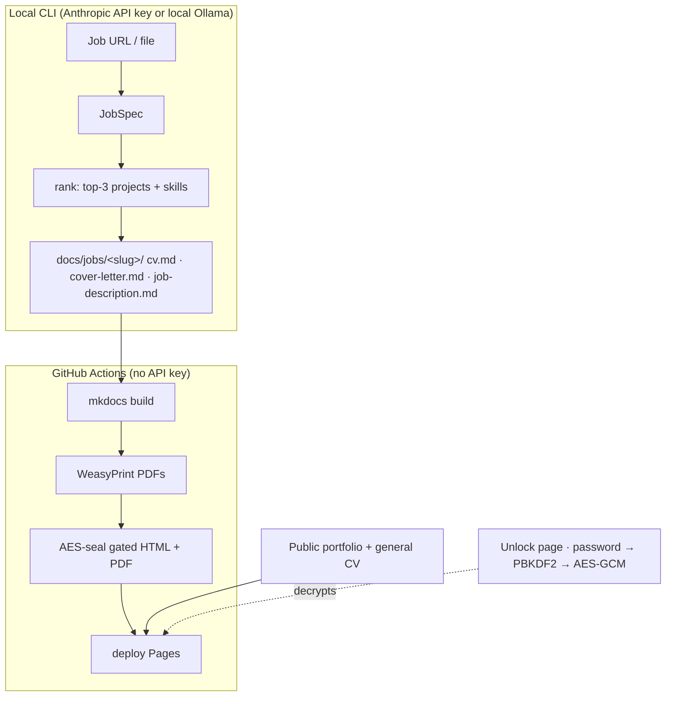

# cv-tailor

Generate **job-tailored CVs and cover letters**, render them as an MkDocs site on
**GitHub Pages**, and keep the per-job documents behind a **password gate** while the
general portfolio stays public.

> **Public demo — fictional persona.** This repo ships no real personal data. The
> identity ("John Doe", `john.doe@example.com`, `github.com/johndoe`) and the employer
> names are invented. The *projects* and career structure are kept for realism. Do not
> commit real names, emails, phone numbers, or personal links.

## How it works



Two halves with a hard boundary:

- **Generation** (`engine/`) runs **locally** and commits Markdown. `engine/rank.py` is a
  pure, unit-tested function that picks the **top-3 projects** and orders the **skills**
  block; the Claude API only writes prose around those choices.
- **Render + gate + deploy** (`build.py`, `.github/workflows/deploy.yml`) runs in **CI**
  with no API key. It builds the site, makes PDFs, and **encrypts** the gated documents.

### The gate (why it's safe on static hosting)

GitHub Pages is static, so a password can't be a server secret — anything shipped is
inspectable. Instead, the gated CV/cover-letter **pages and their PDFs are AES-256-GCM
encrypted at build time** with a key derived (PBKDF2-SHA256) from the `GATE_PASSWORD`
GitHub Actions secret. Only ciphertext ships. The browser asks for the password, derives
the key with Web Crypto, and decrypts in memory ([docs/assets/vault.js](docs/assets/vault.js)).
The password is never in the bundle. Because PDFs are encrypted too, a gated PDF is never
reachable at a public URL.

## Usage

### 1. Generate a tailored application (local)

```bash
pip install -e '.[generate,fetch]'      # Anthropic backend (+ URL fetch)
export ANTHROPIC_API_KEY=...
cv-tailor new path/to/job.txt           # or a URL (needs: playwright install chromium)
```

Writes `docs/jobs/<slug>/` (cv, cover-letter, job-description, and the unlock hub). Review
and edit it, add the printed nav line to `mkdocs.yml`, and commit. Set
`CV_TAILOR_MODEL=claude-opus-4-8` to use Opus instead of the default Sonnet 4.6.

**Local Ollama (no API key):** install `pip install -e '.[ollama]'` and point at any
OpenAI-compatible endpoint:

```bash
cv-tailor new path/to/job.txt --provider ollama \
  --ollama-url http://localhost:11434/v1 --model qwen3.5:35b
```

#### Model support

One provider per run, selected with `--provider` (or `CV_TAILOR_PROVIDER`); pick a model with
`--model` (or `CV_TAILOR_MODEL`).

| Provider | Install | Default model | Auth |
|---|---|---|---|
| **Anthropic** (default) | `.[generate]` | `claude-sonnet-4-6` | `ANTHROPIC_API_KEY` |
| **Ollama** / OpenAI-compatible | `.[ollama]` | `qwen3.5:35b` | none (local) |

```bash
cv-tailor new path/to/job.txt --model claude-opus-4-8        # Anthropic, Opus
cv-tailor new path/to/job.txt --provider ollama --model llama3.1:70b
```

See the **[CLI reference](docs/cli.md)** for every flag, env var, and more examples.

### 2. Build + gate locally

```bash
pip install -e .                        # mkdocs-material, weasyprint, cryptography, pyyaml, markdown
GATE_PASSWORD=test python build.py
python -m http.server -d site 8000      # open http://localhost:8000/
```

The public portfolio and general CV load freely; a `jobs/<slug>/` page prompts for the
password, then renders the CV/cover letter and downloads the decrypted PDF.

### 3. Deploy

Push to `main`. In the repo: **Settings → Pages → Source: GitHub Actions**, and add a
**`GATE_PASSWORD`** secret (Settings → Secrets and variables → Actions). The workflow
renders, gates, and deploys.

## Tests

```bash
pytest -q        # ranking logic — no browser, no API key
```

## Layout

| Path | What |
|---|---|
| `data/` | `master-cv.md`, `profile.yml`, `projects.yml`, guides — the source of truth |
| `engine/` | generation pipeline (`rank` is pure; `jobspec`/`render` call Claude) |
| `docs/` | MkDocs content; `docs/jobs/<slug>/` are gated |
| `build.py` / `encrypt.py` | render + AES-seal the gated content |
| `docs/assets/vault.js` | in-browser PBKDF2 + AES-GCM decryptor |
