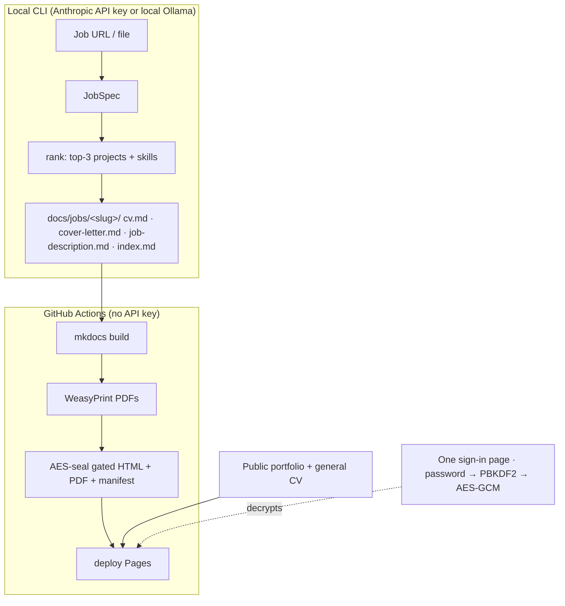

# cv-tailor

**Tailor a CV and cover letter to every job, version each application in git, and track the
whole pipeline — from a single private, password-gated site.**

cv-tailor turns a job posting into a role-specific CV + cover letter, commits every
application to git, and publishes them as an [MkDocs](https://www.mkdocs.org/) site on GitHub
Pages. Your portfolio stays public; the per-job documents — and even the list of which roles
you're chasing — sit behind one password. **Git is the application tracker:** commits are the
audit trail, and a `status` field drives each application's lifecycle. No spreadsheet, no
external tool.

> **Private repo — real data.** This is Radheem Bin Razi's personal CV repo. The public GitHub
> Pages site shows the portfolio and master CV; per-job applications (and even the list of which
> roles are being chased) sit behind the password gate and are AES-sealed before deploy. Keep
> the repo private and the gate strong.

## Why use it

- **Tailored, not generic.** A pure, unit-tested ranker picks your top-3 most relevant
  projects and orders your skills per posting; the LLM only writes prose around those facts —
  so it never fabricates experience.
- **You steer the selection.** A controlled tag **taxonomy** clusters projects and jobs into
  shared domains, per-project **weights** favor your flagships, and `data/ranking.yml` lets you
  set preferences (weights, pins/excludes) — the selection counterpart to the prose guides.
- **Every application is versioned.** Each role is a folder of Markdown under git. Diff a CV
  across roles, roll back an edit, see exactly what you sent and when.
- **A real lifecycle, tracked in git.** Mark an application
  `draft → applied → interview → offer / rejected / withdrawn`; the gated dashboard shows a
  status badge and `git log` is the history.
- **Private by construction.** Tailored CVs, cover letters, their PDFs, and the manifest of
  applications are AES-256-GCM encrypted at build time — safe even on static hosting. The
  password is never in the bundle.
- **Bring your own model.** Generate with the Anthropic API or a fully local Ollama /
  OpenAI-compatible endpoint (offline, no key).

## Use cases

- **Active job search** — fan out tailored applications to many roles and track each one's
  status without leaving your editor.
- **A portfolio that gates the sensitive bits** — keep projects and a general CV public, hide
  role-specific materials behind a shared password you hand to a recruiter.
- **Truth-first CV automation** — let an agent draft, but keep facts pinned to a master CV you
  control in `data/`.

## How it works



A hard boundary splits the two halves: **generation** runs locally and commits Markdown;
**render + gate + deploy** runs in CI with no API key. The whole Tailored section lives behind
**one sign-in page** whose application list is itself encrypted, so no role or company name
leaks before sign-in.

→ **Full design & threat model:** **[docs/architecture.md](docs/architecture.md)**

## Quick start

```bash
pip install -e '.[generate,fetch]'      # Anthropic backend (+ URL fetch)
export ANTHROPIC_API_KEY=...
cv-tailor new path/to/job.txt           # writes docs/jobs/<slug>/ — review, then commit + push
```

Push to `main` and GitHub Actions renders, gates, and deploys. Prefer local generation? Use
`--provider ollama`. The encrypted demo above is unlocked with the repo's `GATE_PASSWORD`.

→ **Step-by-step setup, deploy, and the gate test:** **[docs/setup.md](docs/setup.md)**
→ **Every CLI flag, env var, and model option:** **[docs/cli.md](docs/cli.md)**
→ **Agent / contributor workflow + application lifecycle:** **[CLAUDE.md](CLAUDE.md)**

## Make targets

A `Makefile` wraps the whole workflow. Run `make` (or `make help`) for the full,
self-documenting list. The common ones:

```bash
make help                 # list every target with a description
make install-all          # base + generate + fetch + ollama + dev (uv venv)
make playwright           # install Chromium (only needed to fetch job URLs)

# Generate a tailored application (the cv-tailor CLI):
make new SOURCE=path/to/job.txt
make new SOURCE=job.txt SLUG=acme-senior-engineer RECIPIENT="Jane Smith"
make new SOURCE=job.txt PROVIDER=ollama OLLAMA_URL=http://localhost:11434/v1 MODEL=qwen3.5:35b

# Move an application along its lifecycle (edits the hub's status: front matter):
make status SLUG=acme-senior-engineer STATUS=applied   # draft→applied→interview→offer/rejected/withdrawn

# Build, preview, test:
make build                # render + AES-seal the gated site into ./site (GATE_PASSWORD=test)
make serve                # live MkDocs preview (ungated) at http://localhost:8000
make preview              # build the gated site AND serve it — to test the password gate
make test                 # unit tests (ranking logic; no browser, no API key)
make check                # tests + a full gated build (pre-push sanity)
make clean                # remove site/, caches, *.egg-info
```

Overridable variables: `SOURCE`, `SLUG`, `RECIPIENT`, `PROVIDER`, `MODEL`, `OLLAMA_URL`
(for `new`), `SLUG`/`STATUS` (for `status`), plus `PORT` and `GATE_PASSWORD`.

## Layout

| Path | What |
|---|---|
| `data/` | `master-cv.md`, `profile.yml`, `projects.yml`, `guides/`, and ranking config (`taxonomy.yml`, `ranking.yml`) — the source of truth |
| `engine/` | generation pipeline (`rank` is pure: token + alias + cluster scoring; `jobspec`/`render` call the LLM) |
| `docs/` | MkDocs content; `docs/jobs/<slug>/` are the gated applications |
| `build.py` / `encrypt.py` | render + AES-seal the gated content and the manifest |
| `docs/assets/vault.js` | in-browser PBKDF2 + AES-GCM decryptor + status dashboard |

## Tests

```bash
make test        # (or: pytest -q) — ranking logic, no browser, no API key
```
