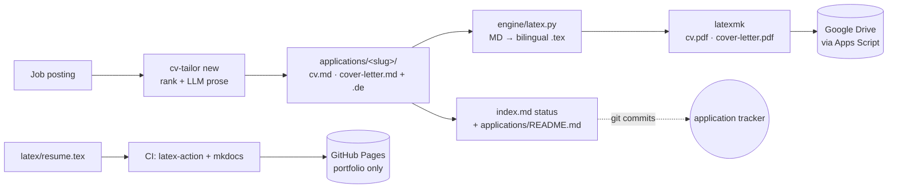

# my-cv

**Tailor a CV + cover letter to every job, render them as bilingual LaTeX PDFs, store the PDFs
in Google Drive, and track every application's status in git — while a clean public portfolio
ships to GitHub Pages.**

> **Private repo — real data.** This is Radheem Bin Razi's personal CV repo. The public
> [MkDocs](https://www.mkdocs.org/) site (`radheem.github.io/my-cv`) shows **only the portfolio**
> (projects + a general CV). Job applications live in `applications/` — **outside** the published
> tree — so no company name ever leaks. Keep the repo private.

## How it works



- **Generation** (local, needs an LLM) — a pure, unit-tested ranker picks the top-3 projects and
  orders skills; the LLM only writes prose, so it never fabricates. A German translation pass
  makes the output bilingual.
- **Rendering** — `engine/latex.py` deterministically turns the Markdown into LaTeX using the
  `resume`-project template (`latex/resume.cls` / `coverletter.cls`); `latexmk` compiles a
  2-page **English-then-German** `cv.pdf` and `cover-letter.pdf`. The model never emits LaTeX.
- **Storage** — the tailored PDFs go to **Google Drive** (one folder per role) via a Google
  Apps Script web app; the repo keeps the Markdown/`.tex` source and a Drive link.
- **Tracking** — each application's `status` lives in git (`applications/<slug>/index.md`), with
  `applications/README.md` as the at-a-glance table. Commits are the audit trail.
- **Publishing** — CI compiles the generic CV (`latex/resume.tex → docs/assets/cv.pdf`) and
  builds the portfolio. No secrets, no gate.

## Quick start

```bash
make install-all                                  # uv venv + deps
# 1. capture jobs (containerized LinkedIn session) — see docs/runbooks.md
make docker-login                                 # first-time VNC login
make docker-ingest KEYWORDS="platform engineer" LIMIT=5
# 2. generate + render + ship one application
make docker-generate SLUG=<slug>                  # JD → cv.md/cover-letter.md (+ German)
make pdf SLUG=<slug>                              # bilingual PDFs (LaTeX; local or texlive Docker)
make upload SLUG=<slug>                           # → Google Drive (see apps-script/README.md)
make status SLUG=<slug> STATUS=applied            # advance + refresh the tracker
```

`cv-tailor new <job.txt>` generates locally with the Anthropic API (`ANTHROPIC_API_KEY`) or a
local Ollama / OpenAI-compatible endpoint (`--provider ollama`). PDF compile needs LaTeX —
local `latexmk`, otherwise the `texlive/texlive` Docker image (auto-detected).

→ **Agent / contributor workflow:** [CLAUDE.md](CLAUDE.md)
→ **Google Drive setup:** [apps-script/README.md](apps-script/README.md)
→ **LinkedIn ingest runbooks:** [docs/runbooks/](docs/runbooks/)

## Layout

| Path | What |
|---|---|
| `data/` | source of truth — `master-cv.md`, `profile.yml`, `projects.yml`, `guides/`, prompts, ranking config |
| `engine/` | `rank` (pure top-3/skills), `jobspec`/`render` (LLM), `latex` (MD→LaTeX), `cli` |
| `latex/` | `resume.cls`, `coverletter.cls`, `resume.tex` (public CV) — shared LaTeX style |
| `applications/<slug>/` | one dir per application (md + `.tex` + `index.md` metadata); PDFs gitignored (in Drive) |
| `applications/README.md` | the status tracker table |
| `apps-script/` | the Google Drive uploader (`Code.gs`) + setup |
| `scripts/build-application.sh` | compile an app's `.tex` → PDFs |
| `docs/` | the **public** portfolio (Home, Projects, CV) |

## Tests

```bash
make test    # ranking + render + MD→LaTeX (pytest) — no browser, no API key, no LaTeX needed
```
