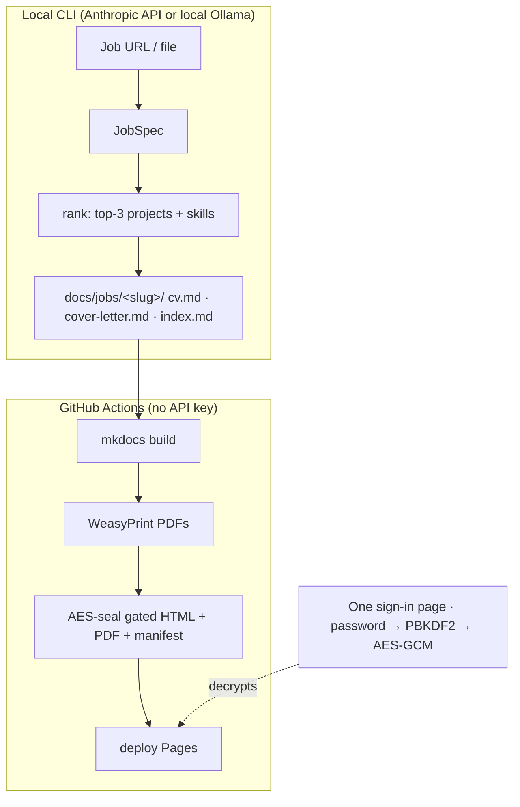

# cv-tailor — LLM CV/Cover-Letter Tailoring + LinkedIn Automation

A Python tool that turns a **job posting** into a **tailored CV + cover letter**, versions every application in **git**, and publishes them as a **password-gated MkDocs site**. A pure, unit-tested ranker decides *what* to feature; the LLM only writes prose around facts pinned in a master CV, so it never fabricates experience. A containerized LinkedIn flow captures job descriptions and drafts applications end-to-end — and always **stops before submit** for human review.

!!! abstract "At a glance"
    **Domain**: LLM application / automation &nbsp;·&nbsp; **Repo**: [github.com/radheem/cv-tailor](https://github.com/radheem/cv-tailor) &nbsp;·&nbsp; **Stack**: Python · Playwright · Docker · MkDocs · GitHub Actions

> This very site is built and gated by cv-tailor. The public repo ships a fictional **John Doe**
> persona; the private twin runs the same engine on real data.

## What it is
Two halves separated by a hard boundary:

- **Generation** runs **locally**, costs money, needs review, and commits Markdown. It extracts a structured **JobSpec** from a posting, ranks projects + skills against it deterministically, then has an LLM write the CV/cover prose.
- **Render + gate + deploy** runs in **CI with no API key**. It builds the MkDocs site, renders PDFs, and **AES-256-GCM-encrypts** the per-job documents — and the manifest of applications — before deploying to GitHub Pages.

## How it works

## Deterministic ranking, LLM prose only
The selection core (`engine/rank.py`) is **pure and unit-tested** — no LLM in the loop:

- Scores each project by token overlap against the extracted JobSpec, plus **cluster affinity** (a controlled tag taxonomy classifies both jobs and projects into shared domains) and a **per-project weight** that favors flagships.
- Picks the **top-3 projects** and orders the skill groups per posting.
- Only `jobspec` extraction and `render` call the LLM, and only to write prose around the already-selected facts. Tailoring is reordering and emphasis, **never invention** — facts are pinned to a master CV.

## Git as the application tracker
There is no spreadsheet or external tracker:

- Each role is a folder of Markdown under git — diff a CV across roles, roll back an edit, see exactly what was sent and when.
- A `status` field drives the lifecycle **draft → applied → interview → offer | rejected | withdrawn**; commits are the audit trail and the gated dashboard shows a status badge.

## Private by construction
- Tailored CVs, cover letters, their PDFs, **and the list of which roles are being chased** are **AES-256-GCM** encrypted at build time — safe even on static hosting.
- The password is never in the bundle: the browser derives the key with **PBKDF2** and decrypts client-side (`vault.js`). No role or company name leaks before sign-in.

## LinkedIn ingestion (stop-before-submit)
An optional containerized flow drives a logged-in LinkedIn session and feeds the generator:

- **Playwright** persistent context with **human-paced** typing/clicks; a first login hands off to a **VNC** viewer to solve the one-time security check, then the warm profile is a recognized device.
- Searches roles, captures full job descriptions (dedup ledger), then generates a tailored application per role — all in Docker, output to a gitignored vault.
- **Code never submits.** Every run stops at a ready-to-apply package a human reviews and sends by hand.

## Reproducible & configurable
- Provider, model, temperatures, budgets, and the system **prompts** are user-editable files under `data/` — no code change needed; an absent file = default behavior, and env overrides the file.
- Every application writes a **`manifest.json`** (model, seed, prompt + input hashes) so a result is re-derivable, and a **quality benchmark** gates against regressions (heuristic + LLM judge).

## Key achievements
- Built an **LLM CV/cover generator** whose selection logic is pure and unit-tested, keeping the model on prose and **off facts** (no fabricated experience).
- Designed a **git-native application tracker** with a commit-driven status lifecycle — no external tooling.
- Implemented a **zero-trust static gate**: in-browser PBKDF2 + AES-256-GCM with an encrypted application manifest, deployed by GitHub Actions **without any API key in CI**.
- Added a **containerized, human-in-the-loop LinkedIn pipeline** (Playwright + Xvfb + VNC) that ingests JDs and drafts applications end-to-end while preserving stop-before-submit.
- Made generation **reproducible and regression-gated** via per-run manifests and a benchmark harness.

## Tech stack
`Python` · `Anthropic API` · `Ollama / OpenAI-compatible` · `Playwright` · `Docker` · `Xvfb + x11vnc` · `MkDocs Material` · `WeasyPrint` · `AES-256-GCM` · `PBKDF2` · `GitHub Actions` · `pytest`
