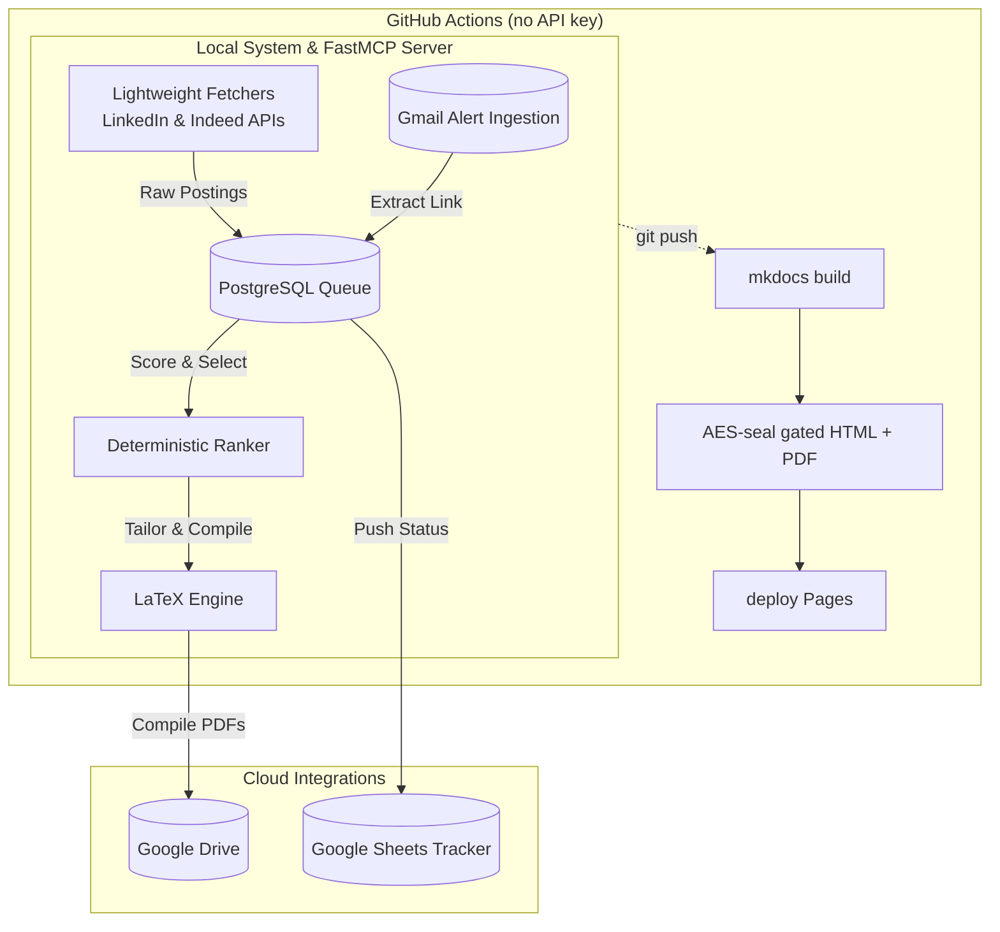

# cv-tailor — LLM CV/Cover-Letter Tailoring & Agentic Job-Hunting Pipeline

A Python CLI and **FastMCP Server** that automates the job application tailoring process, manages application lifecycle tracking via **PostgreSQL**, and publishes password-gated portfolios to **GitHub Pages**. A pure, unit-tested ranker selects top projects and orders skills, leaving the LLM to write prose around pinned master CV facts (zero fabrication). Automates discovery via **Gmail alert parsing** (LinkedIn, Indeed, Glassdoor, Fraunhofer), performs lightning-fast fetching via platform-specific **guest API endpoints**, and synchronizes pipeline states bi-directionally with **Google Sheets**.

!!! abstract "At a glance"
    **Domain**: LLM Agent Tools / Workflow Automation &nbsp;·&nbsp; **Repo**: [github.com/radheem/cv-tailor](https://github.com/radheem/cv-tailor) &nbsp;·&nbsp; **Stack**: Python · FastMCP · PostgreSQL · Google Apps Script · Docker · MkDocs

> This very site is built and gated by cv-tailor. The public repo ships a fictional **John Doe**
> persona; the private twin runs the same engine on real data.

## What it is
A secure, distributed pipeline connecting local agentic automation with cloud visibility:

- **Local FastMCP Server & Database:** Exposes a secure, read-only SQL parsing layer and generation workflows to agentic assistants. Manages application state in PostgreSQL and discovers roles automatically via Gmail alert body parsing.
- **Lightweight Scraping & Ingestion:** Uses specialized guest API endpoints (`fetch_linkedin_job` and `fetch_indeed_job` with JSON/HTML fallback) to download postings under 2 seconds, completely avoiding dynamic browser CAPTCHA walls.
- **LaTeX Compilation & Storage:** Generates English/German Markdown documents and compiles them locally via `latexmk` into professional PDFs. Packages are uploaded automatically to Google Drive, and statuses sync with Google Sheets.
- **Render + gate + deploy:** Runs in CI with no API key. Encrypts documents with AES-256-GCM at build time (password derived client-side via PBKDF2) and deploys safely to static GitHub Pages.

## How it works

## Deterministic ranking, LLM prose only
The selection core (`engine/rank.py`) is **pure and unit-tested** — no LLM in the loop:

- Scores each project by token overlap against the extracted JobSpec, plus **cluster affinity** (a controlled tag taxonomy classifies both jobs and projects into shared domains) and a **per-project weight** that favors flagships.
- Picks the **top-3 projects** and orders the skill groups per posting.
- Only `jobspec` extraction and `render` call the LLM, and only to write prose around the already-selected facts. Tailoring is reordering and emphasis, **never invention** — facts are pinned to a master CV.

## Git as the application tracker
There is no spreadsheet or external tracker:

- Each role is a folder of Markdown under git — diff a CV across roles, roll back an edit, see exactly what was sent and when.
- A `status` field drives the lifecycle **draft → applied → interview → offer | rejected | withdrawn**; commits are the audit trail and the gated dashboard shows a status badge.

## Private by construction
- Tailored CVs, cover letters, their PDFs, **and the list of which roles are being chased** are **AES-256-GCM** encrypted at build time — safe even on static hosting.
- The password is never in the bundle: the browser derives the key with **PBKDF2** and decrypts client-side (`vault.js`). No role or company name leaks before sign-in.

## LinkedIn ingestion (stop-before-submit)
An optional containerized flow drives a logged-in LinkedIn session and feeds the generator:

- **Playwright** persistent context with **human-paced** typing/clicks; a first login hands off to a **VNC** viewer to solve the one-time security check, then the warm profile is a recognized device.
- Searches roles, captures full job descriptions (dedup ledger), then generates a tailored application per role — all in Docker, output to a gitignored vault.
- **Code never submits.** Every run stops at a ready-to-apply package a human reviews and sends by hand.

## Reproducible & configurable
- Provider, model, temperatures, budgets, and the system **prompts** are user-editable files under `data/` — no code change needed; an absent file = default behavior, and env overrides the file.
- Every application writes a **`manifest.json`** (model, seed, prompt + input hashes) so a result is re-derivable, and a **quality benchmark** gates against regressions (heuristic + LLM judge).

## Agentic Workflows & Model Context Protocol (FastMCP)
The CLI can be launched as a fully functional **FastMCP Server** (`make mcp`), exposing database context, taxonomy query capabilities, and document generation workflows to agentic assistants. 

Agents orchestrate our job-hunting pipeline using a robust **3-Step Ingestion Trilogy**:
1. **Discover:** The server searches **Gmail API alerts** from major job boards (LinkedIn, Indeed, Glassdoor, and Fraunhofer) and compiles an unread queue with tentative metadata.
2. **Lightweight Ingest:** Bypasses heavy browser automation and CAPTCHAs via dedicated **guest API endpoints** (`fetch_linkedin_job` and `fetch_indeed_job` with automatic JSON/HTML fallback) to fetch raw job postings instantly.
3. **Score & Tailor:** The agent runs a read-only SQL query (secured via an **SQL Guard parsing layer**) to select the highest scoring roles, saves them, and calls document workflows to compile CVs + cover letters and render LaTeX PDFs.

## Bi-Directional Cloud Status Sync
To ensure real-time visibility across devices, a bi-directional synchronization pipeline links our local PostgreSQL database with **Google Sheets**. Using a lightweight **Google Apps Script proxy**, lifecycle changes (e.g., advancing from *draft* to *applied* or *interview*) flow seamlessly back and forth on demand.

## Key achievements
- Built an **LLM CV/cover generator** whose selection logic is pure and unit-tested, keeping the model on prose and **off facts** (no fabricated experience).
- Built a high-signal **FastMCP Server** enabling agentic AI assistants to autonomously query local data and trigger tailoring workflows.
- Implemented a **3-step agentic ingestion pipeline** (Gmail discovery -> guest API fetchers -> PostgreSQL scoring -> PDF render) that bypasses Playwright dynamic crawl blocks.
- Designed a **git-native application tracker** with a commit-driven status lifecycle and bi-directional **Google Sheets Apps Script sync**.
- Implemented a **zero-trust static gate**: in-browser PBKDF2 + AES-256-GCM with an encrypted application manifest, deployed by GitHub Actions **without any API key in CI**.
- Added a **containerized, human-in-the-loop LinkedIn pipeline** (Playwright + Xvfb + VNC) that ingests JDs and drafts applications end-to-end while preserving stop-before-submit.
- Made generation **reproducible and regression-gated** via per-run manifests and a benchmark harness.

## Tech stack
`Python` · `FastMCP` · `PostgreSQL` · `Google Apps Script` · `Gmail API` · `Anthropic API` · `Ollama / OpenAI-compatible` · `Playwright` · `Docker` · `Xvfb + x11vnc` · `MkDocs Material` · `WeasyPrint` · `AES-256-GCM` · `PBKDF2` · `GitHub Actions` · `pytest`
