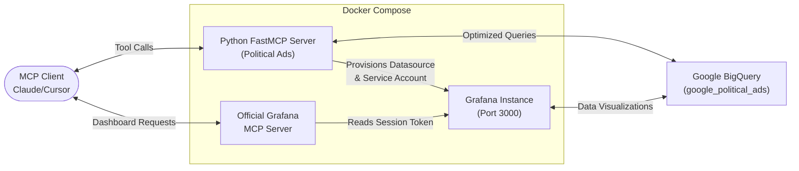

# Data Analyzer (BigQuery MCP)

An intelligent Model Context Protocol (MCP) and visualization pipeline for Google's public Political Ads transparency dataset. This project provides secure, bounded LLM access to massive BigQuery datasets while simultaneously orchestrating Grafana for rich visualizations.

!!! abstract "At a glance"
    **Role**: Backend & Platform Engineer &nbsp;·&nbsp; **Stack**: Python · FastMCP · Google BigQuery · Grafana · Docker Compose
    
    **Repo**: [github.com/radheem/big-query](https://github.com/radheem/big-query)

## Architecture

The system is split into two synchronized, high-performance services orchestrated via Docker Compose:

1. **Political Ads MCP Server**:
   - Python-based `FastMCP` application exposing specialized BigQuery tools.
   - Restricts LLM token usage by utilizing targeted dataset queries (`get_top_advertisers`, `search_advertiser_ads`) instead of raw SQL spikes.
   - Automatically provisions a BigQuery datasource inside Grafana on boot.

2. **Official Grafana MCP Server**:
   - Runs alongside Grafana to provide standard MCP capabilities.
   - Automatically loads persistently provisioned Service Account Tokens.
   - Enables any MCP client (Claude Desktop, Cursor, Zed) to query, search, build, patch, and export visual Grafana dashboards dynamically.

## Highlights
- Built a **FastMCP Python server** exposing optimized BigQuery tools to prevent raw SQL token spikes.
- Orchestrated **Docker Compose synchronization** between Python FastMCP, Grafana, and the official Grafana MCP server.
- Automated **zero-touch provisioning** of GCP credentials, Grafana Service Accounts, and BigQuery datasources on boot.
- Deployed documentation via **MkDocs Material** integrated with GitHub Actions artifacts.

## Tech Stack
`Python 3.12+` · `FastMCP` · `Google BigQuery` · `Grafana` · `Docker Compose` · `GitHub Actions`
