# Information Retrieval System (IRS) — Stealth Project

A large Go monorepo implementing an event-driven, multi-service platform that aggregates data from multiple bot-protected third-party vendor portals, normalizes disparate vendor schemas into a canonical model, exposes it through unified APIs (gRPC / REST / **MCP**), and records every response through a durable ingestion pipeline — all on Kubernetes.

!!! note "Stealth project"
    **Information Retrieval System (IRS)** is an active commercial project, so vendor names and business-domain specifics are intentionally generalized here (vendors appear as **Vendor A / B / C**, data as generic **domain entities**). This page describes only the **technical architecture**.

!!! abstract "At a glance"
    **Role**: Distributed systems / backend engineer &nbsp;·&nbsp; **Scale**: hundreds of Go files across per-service modules, multiple vendor stacks, 15+ architecture decision records.

## Architecture

```mermaid
flowchart TB
  AG[AI agents / LLM clients]
  CL[Clients<br/>gRPC / REST]
  subgraph plat[IRS platform — Kubernetes]
    MCP[MCP toolbox server<br/>declarative tools · hot-reload]
    GW[Envoy gateway<br/>ring-hash on session_id]
    FAC[API facade + lookup service<br/>unified gRPC / REST]
    subgraph data[Vendor data services &#40;per vendor&#41;]
      DS[URL builders · parsers<br/>one RPC per vendor call]
      AR[Archiver<br/>non-blocking · drop on backpressure]
    end
    subgraph px[Punchout service &#40;per vendor&#41;]
      PA[Vendor adaptor<br/>login · validate · refresh · logout]
      PW[Playwright<br/>headless Chromium]
      PA --- PW
    end
    KV[(NATS KV<br/>sessions + AES-256-GCM creds)]
    JS[(NATS JetStream<br/>per-vendor streams)]
    subgraph etl[ETL consumer — Hatchet]
      CON[cron-poll consumer]
      TR[transformers<br/>Validate→Normalize→Convert→Save]
      CON --> TR
    end
    PG[(PostgreSQL<br/>sqlc staging)]
    DG[(Dgraph<br/>entity graph)]
    DOC[(DocumentDB<br/>raw cold archive)]
  end
  VP[(Vendor portals<br/>Vendor A · B · C)]
  OBS[OpenTelemetry → VictoriaMetrics / VictoriaLogs → Grafana]

  AG -->|MCP| MCP --> FAC
  CL --> GW --> FAC --> DS
  DS -->|Get/Post/Navigate| PA
  PW --> VP
  PA --> KV
  DS --> AR --> JS --> CON
  CON --> DOC
  TR --> PG
  TR --> DG
  plat -.-> OBS
```

## Highlights
- Built Go microservices with **gRPC and gRPC-Gateway** using **Protobuf-first APIs** (proto3 + **buf**) — a single typed source of truth, compile-checked end to end.
- **Migrated the platform off Dapr** to a leaner stack: **native NATS JetStream** for messaging, **NATS KV** for durable session state, and **direct gRPC** between services — removing the sidecar and making the message subject the explicit routing key.
- Built an **MCP (Model Context Protocol) integration** that exposes the platform to LLM agents as declarative, hot-reloadable tools (entity lookup, domain search, health).
- Designed a **per-user authenticated browser-session service** (punchout) using **Playwright** headless Chromium, with one-context-per-session, gateway consistent-hashing, and an **AES-256-GCM** encrypted credential vault.
- Built a **best-effort ETL ingestion side-channel** that records every vendor response off the read path — a bus outage never adds latency to, or fails, a client query.
- Designed a **vendor-adaptor contract** (anti-corruption layer) that keeps the platform vendor-agnostic while each vendor integration (A / B / C) owns its quirks.
- Deployed cloud-native with **Kubernetes + kustomize overlays**, **Skaffold**, **Cilium** gateway/LB, and **external-dns**.

## Architecture & Patterns
- **Protobuf-first API design** — every contract defined in `.proto`, generated via buf; gRPC for inter-service calls, grpc-gateway deriving a REST/JSON surface for external clients.
- **No sidecar (Dapr removed)** — sessions/state on NATS KV, pub/sub on native JetStream, inter-service via direct gRPC. One fewer moving part; the subject is the routing key.
- **Per-user sessions, no shared service account** — each user authenticates with their own vendor credentials and receives a `session_id`; concurrency comes from many users = many sessions.
- **Anti-corruption / adaptor pattern** — a vendor integration splits along one seam: a *browser/auth adaptor* (login, validate, refresh, logout) inside the punchout deployment, and a *data service* (URL builders, response parsers, one RPC per vendor call).
- **Declarative, config-driven routing** — ETL routing is declarative on both ends (producer `informationType → subjects`, consumer `subject → events`), each one-to-many; routing changes without a rebuild.
- **Architecture Decision Records** — cross-cutting choices captured as append-only ADRs alongside a locked "foundational decisions" stack doc.

## MCP Integration — AI-Agent Tooling
The platform is exposed to LLM agents over the **Model Context Protocol**, turning its query surface and datastore into agent-callable tools.

- **Declarative tool definitions** — tools (entity lookup, domain search, health probes) are described in **versioned YAML config**, not code, so the tool surface evolves without redeploying the binary.
- **Config-driven MCP toolbox server** — runs on Kubernetes from a config-folder image; a poll interval **hot-reloads** tool configs at runtime, and `--enable-api` exposes management endpoints.
- **Backed by the unified API + database** — tools resolve against the same gRPC facade and relational store the rest of the platform uses, so agents get the same canonical data as any other client.

## Punchout — Authenticated Browser Sessions
Vendor portals are browser-first and bot-protected, so requests must run from inside a real logged-in session.

- **Stateful, one-deployment-per-vendor** — the browser context lives in one instance's memory; an Envoy gateway routes every request for a session to its owning pod via **consistent hashing (ring-hash) on `session_id`**.
- **Durable identity in NATS KV** — session metadata survives pod churn; the encrypted credential store fails closed in production without its key.
- **Session lifecycle state machine** — login → validate → refresh → delete, with **content-based auth-failure classification** (some vendors return the login page with `200 OK`) and refresh-failure terminating the session rather than self-healing.

## ETL Ingestion Pipeline
A durable record of every vendor response, decoupled from the synchronous query path.

- **Best-effort archival side-channel** — handlers *offer* each response to an in-process Archiver with a bounded buffer and non-blocking drain workers; on backpressure it **drops rather than blocks**.
- **Per-vendor JetStream streams**, created by idempotent **stream-init Jobs**, with the subject as routing key.
- **Consumer pipeline** — cron-poll NATS consumer → **DocumentDB** cold archive of every raw message → **Hatchet** transformer workflows (*Validate → Normalize → Convert → Save*) → **PostgreSQL** canonical staging across several entity categories.
- **One-to-many fan-out** — a single payload category can fan out to multiple typed events; a `trace_id` correlates an API request to all its derived rows.

## Data & Schema
- **PostgreSQL + sqlc** — type-safe Go generated from `.sql`; no ORM, no hand-built query strings.
- **Dgraph** — graph store for entity cross-references and inheritance, keeping the relational store transactional.
- **DocumentDB (Mongo-compatible)** — schemaless cold archive of raw payloads, kept separate from relational staging for replay.
- **Versioned schema migrations** — a dockerized DB-init runs dump → create → restore → verify Jobs to populate each schema version idempotently.
- **CUE** — declarative vendor→canonical transform mappings on one vendor lineage (others use Go normalizers).

## Engineering & Delivery
- **Observability** — OpenTelemetry context propagation correlates a request to its fan-out by `trace_id`; metrics into **VictoriaMetrics**, logs into **VictoriaLogs**, dashboards in **Grafana**; a **Swagger UI** serves the generated REST API docs.
- **Browserless test path** — per-vendor **mock** services serve canned fixtures and a `TESTING` adaptor runs without Chromium, so CI/E2E never touches a real vendor.
- **Post-deployment E2E gate** — black-box **Ginkgo** suite runs as a Kubernetes Job against the deployed gRPC surface plus a read-only DB probe.
- **Deploy** — **kustomize** overlays (`dev` / `genai` / `mock` / `prod`), **Skaffold** multi-module build/push, **Cilium** L2 LoadBalancer + Gateway, **external-dns** hostnames; **GitLab CI** builds on merge/tag with explicit, overlay-scoped manifest promotion.

## Tech Stack
`Go 1.25` · `gRPC` · `gRPC-Gateway` · `Protocol Buffers` · `buf` · `MCP` · `NATS JetStream` · `NATS KV` · `Hatchet` · `Playwright` · `CUE` · `PostgreSQL (sqlc)` · `Dgraph` · `DocumentDB` · `Kubernetes` · `kustomize` · `Skaffold` · `Cilium` · `external-dns` · `OpenTelemetry` · `VictoriaMetrics` · `Grafana` · `Ginkgo` · `AES-256-GCM`

!!! note "Architecture evolution"
    An earlier iteration used a **Dapr** sidecar for service invocation, state, and pub/sub. The platform has since moved to native NATS (JetStream + KV) and direct gRPC — so this write-up reflects the current sidecar-free architecture.
