# HA K3s Cluster Platform — k3d + Cilium L2

A fully automated platform for standing up **high-availability K3s clusters in Docker** (k3d), running **kube-proxy-free in eBPF mode** with Cilium as the sole CNI. It provides bare-metal `LoadBalancer` services via Cilium **L2 announcements + LB-IPAM**, survives host reboots through a custom sequential-boot orchestrator, self-heals its CNI datapath, and exposes services across a self-hosted tailnet.

!!! abstract "At a glance"
    **Role**: Cloud-native / platform engineer &nbsp;·&nbsp; **Scope**: single-entrypoint installer, immutable reboot orchestrator, self-managed CNI + DNS, and an architecture-doc corpus (Cilium Cluster Mesh, reboot-resilience, DNS diagnosis).

## Architecture

```mermaid
flowchart TB
  ADMIN[Operator<br/>./manage.sh install]
  TS[Tailscale / Headscale<br/>subnet router]
  subgraph host[Docker host — single failure domain]
    ORCH[Reboot orchestrator<br/>Docker Compose · restart: always<br/>immutable Alpine image]
    subgraph cluster[k3d cluster &#40;K3s in Docker&#41;]
      SRV[server-0<br/>control plane + API]
      AG0[agent-0]
      AG1[agent-1]
      subgraph cni[Cilium 1.18 — eBPF datapath]
        KPR[kube-proxy replacement<br/>native routing · Maglev LB]
        L2[L2 announcements + LB-IPAM<br/>CiliumLoadBalancerIPPool]
        HUB[Hubble<br/>Relay + UI]
      end
      DNS[CoreDNS<br/>self-managed Helm<br/>pinned to control plane]
      GW[Gateway API CRDs]
    end
    STORE[(Host-path volumes<br/>per-cluster /share · per-node /data<br/>K3s state)]
  end
  LBIP[LoadBalancer service IPs<br/>real host-reachable CIDR]

  ADMIN --> ORCH
  ORCH -->|sequential boot<br/>server-0 → agent-0 → agent-1| SRV
  ORCH --> AG0
  ORCH --> AG1
  ORCH -->|reconcile_cilium.sh<br/>IP-drift purge| KPR
  SRV --- AG0
  SRV --- AG1
  KPR --> L2 --> LBIP
  DNS -.->|upstream forward| TS
  LBIP --> TS
  cluster --> STORE
```

## Highlights
- Built a **single-entrypoint installer** (`manage.sh install | uninstall | install_router`) that provisions an entire cluster end to end: dependency checks, dynamic node/volume layout, `k3d cluster create`, BPF filesystem mount, Gateway API CRDs, Cilium, CoreDNS, L2 policy, optional Tailscale router, and the reboot orchestrator — with a clean, idempotent uninstall that reclaims host state.
- Ran the cluster **kube-proxy-free in eBPF mode** — disabled K3s's Flannel, kube-proxy, servicelb, traefik, and built-in CoreDNS so **Cilium 1.18** owns CNI, service routing, and L2 announcement end to end.
- Delivered **bare-metal `LoadBalancer` services** with `CiliumLoadBalancerIPPool` + `CiliumL2AnnouncementPolicy`, handing real, host-reachable IPs from a configured CIDR — no cloud load balancer.
- Engineered **reboot resilience** with an immutable Docker Compose orchestrator that enforces sequential node boot, defeating Docker's parallel-start IPAM race to keep node IPs stable across host restarts.
- Added a **CNI self-healing fail-safe** (`reconcile_cilium.sh`) that detects IP drift between Kubernetes Nodes and `CiliumNode` CRDs and purges stale resources to force an eBPF datapath rebuild.
- Took **full ownership of DNS** — replaced K3s's reconciled CoreDNS with a self-managed Helm deployment (fixed clusterIP, custom upstream forwarder, control-plane pinning, dynamically rendered `NodeHosts` records).
- Exposed cluster `LoadBalancer` IPs externally via a **Tailscale / Headscale subnet router**, and documented a **Cilium Cluster Mesh** strategy for cross-host HA.

## Architecture & Patterns
- **Declarative, parameterized cluster definition** — `k3d-config.yaml` is fully env-substituted (`${CLUSTER_NAME}`, `${SERVER_COUNT}`/`${AGENT_COUNT}`, pod/service CIDRs, FQDNs, TLS SANs); nothing cluster-specific is hardcoded, so many clusters spin up from one template.
- **kube-proxy-free eBPF datapath** — Cilium native routing (`autoDirectNodeRoutes`, BPF masquerade, `ipam.mode: kubernetes` aligned to the K3s `10.42.0.0/16` CIDR) with Maglev L4/L7 algorithms.
- **Sequential boot enforcement** — the orchestrator starts `server-0`, waits for API + Node Ready, then each agent in turn, coercing Docker's sticky IPAM into reassigning the original IPs.
- **Reconcile / self-heal loop** — drift detection between K8s Node `InternalIP` and `CiliumNode` CRD, then purge-and-rebuild to converge the datapath.
- **Single-control-plane pinning** — CoreDNS scheduled on the control plane via `nodeSelector` so DNS is up the moment the API is, breaking init deadlocks; installation order is Cilium **before** CoreDNS to clear the `not-ready` node taint.
- **Failure-domain reasoning** — the host is treated as one failure domain; true HA comes from connecting independent single-host k3d clusters with Cilium Cluster Mesh (non-overlapping CIDRs, unique cluster id/name, IP stability).

## Reboot Resilience — The Orchestrator
A single-host k3d deployment is fragile: a host reboot restarts all node containers in parallel, and Docker's IPAM can hand out different IPs, corrupting Cilium's eBPF routing tables.

- **Immutable orchestrator image** — tools (`kubectl`, `docker-cli`) and the management scripts are baked into an Alpine image (not host-volume-mounted), so the orchestrator boots **offline** during a host restart without downloads or CRLF/exec failures.
- **`restart: always` Compose service** on the host network owns node lifecycle; node containers themselves are set to `--restart=no` so the orchestrator has total control.
- **Strict sequential start** — `server-0` → wait for API + Ready → each agent in turn — eliminating the parallel-start IPAM race and guaranteeing stable node IPs.

## Networking — Cilium L2 on Bare Docker
- **kube-proxy replacement** — Cilium takes over all service routing; `k8sServiceHost`/`k8sServicePort` point the agent directly at the API server.
- **L2 announcements + LB-IPAM** — a `CiliumLoadBalancerIPPool` over a host-network CIDR plus a `CiliumL2AnnouncementPolicy` on `eth0` make service IPs reachable directly from the host network.
- **Gateway API + Hubble** — Gateway API CRDs installed for L7 routing; Hubble Relay + UI for flow observability.

## DNS — Self-Managed CoreDNS
K3s's built-in CoreDNS reconciles and reverts custom configuration, and a Cilium masquerade boundary mismatch was black-holing UDP/53.

- **Disabled K3s CoreDNS**, deployed the official CoreDNS Helm chart, and **pinned `clusterIP` to `10.43.0.10`** so Kubelet-injected pod resolv.confs still resolve.
- **Custom Corefile** with a fixed upstream forwarder and a `hosts` plugin reading a rendered `NodeHosts` file.
- **`envsubst` rendering** — `manage.sh` extracts the Docker network gateway and each node's `InternalIP` and renders `host.k3d.internal` + node-hostname records into the Helm values at deploy time.

## Engineering & Delivery
- **Pinned, reproducible builds** — K3s, Cilium, and Gateway API versions pinned via `.env`; `.env`-driven configuration for repeatable, multi-cluster provisioning.
- **Documentation discipline** — an append-only changelog capturing goals/fixes/modified-files per iteration, plus standalone architecture, reboot-resilience-research, and DNS-diagnosis plans.
- **Verification trail** — captured connectivity tests, BPF NAT lists, Cilium service lists, and agent logs documenting how the datapath was validated.
- **Clean lifecycle** — uninstall tears down the Compose stack, deletes the cluster, and reclaims persistent host data for fresh reinstalls.

## Tech Stack
`K3s v1.35` · `k3d` · `Cilium 1.18 (eBPF)` · `kube-proxy replacement` · `Gateway API` · `Hubble` · `CoreDNS` · `Helm` · `Docker` · `Docker Compose` · `Bash` · `kubectl` · `envsubst` · `Tailscale / Headscale` · `Local Path Provisioner`
