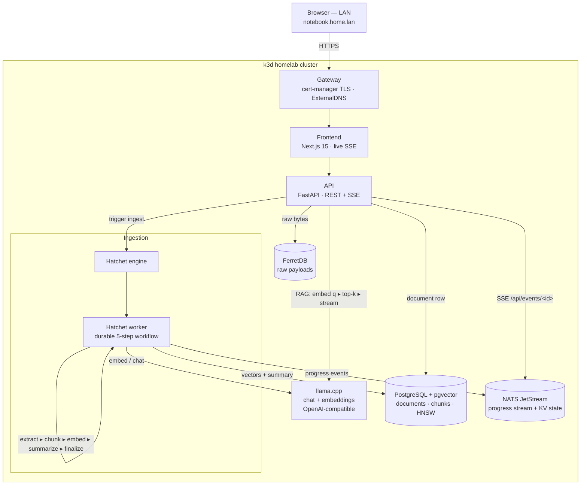

# My Notebook — Self-Hosted Document RAG

A personal **document-intelligence** service that ingests your PDFs, articles, and notes through a durable pipeline — extract → chunk → embed → summarize → index — then lets you **semantic-search and chat over your own documents** (RAG), running **entirely on a Kubernetes homelab** with no cloud calls. All inference is served locally by `llama.cpp`.

!!! abstract "At a glance"
    **Role**: Full-stack / backend + platform engineer &nbsp;·&nbsp; **Scope**: FastAPI backend, Hatchet ingestion workflow, Next.js UI, hybrid Postgres/FerretDB persistence, local LLM inference, and a kustomize deploy onto a k3d cluster.

    **Repo**: [github.com/radheem/my-notebook](https://github.com/radheem/my-notebook) &nbsp;·&nbsp; **Live (LAN-only)**: `notebook.home.lan` on the [Homelab](homelab.md) cluster

## Architecture

## Highlights
- Built a **durable, retryable ingestion pipeline** with **Hatchet** — a five-step workflow (extract → chunk → embed-and-index → summarize → finalize) with **per-step timeouts and retries** that survives worker crashes and re-dispatches safely.
- Designed **real-time progress streaming** over **NATS JetStream** + **SSE**: a durable progress *stream* records every event while a *KV* bucket holds current state, so a new subscriber gets the latest status in O(1) and then live updates — without replaying the whole history.
- Kept all inference **local and private** — two `llama.cpp` servers (chat + embeddings) behind an **OpenAI-compatible** API, so documents never leave the cluster.
- Implemented **vector search with pgvector** (HNSW, cosine), with the embedding dimension **templated from `EMBED_DIM`** at schema-creation time so the index always matches the model.
- Used a **hybrid persistence** split — **PostgreSQL** for relational, ACID source-of-truth data and vectors, **FerretDB** (Mongo-wire) for schemaless raw payloads — both backed by the same Postgres engine.
- Served **grounded RAG chat with citations** — embed the question, run top-k cosine retrieval, and stream the answer from the chat model.
- Deployed **cloud-native** on **k3d**: kustomize manifests, multi-stage Docker builds, a Gateway with **cert-manager** TLS and **ExternalDNS**, persistent volumes for data and GGUF models, health checks, and resource limits.
- Validated end to end — **integration tests** per boundary (Postgres, FerretDB, NATS, llama, Hatchet), **E2E** scenarios (upload, chat-with-citations, crash-recovery durability), and **k6** load/stress budgets.

## How It Works
- **Upload** — the API stores raw bytes in FerretDB, writes a `pending` document row in Postgres, and triggers the Hatchet `ingest_document` workflow.
- **Ingest** — the worker extracts text (pypdf), chunks it (512 chars / 100 overlap), batch-embeds and upserts vectors into pgvector, generates a short summary plus topic tags, and marks the document `ready`. Each step emits a progress event to NATS.
- **Watch** — the browser subscribes to `GET /api/events/<id>` (SSE); the API serves current state from the NATS KV bucket, then streams subsequent events from the JetStream stream.
- **Chat** — a question is embedded, matched against the top-k most similar chunks via pgvector, and answered by the chat model with citations, streamed back token by token.

## Engineering & Delivery
- **Workflow durability** — stateless workers pull from Hatchet, so ingestion scales horizontally and independently of API serving; step-level retries make the pipeline crash-safe.
- **Graceful degradation** — if the model returns unparseable tags, a keyword-frequency fallback guarantees every document still gets at least one tag.
- **Observability hooks** — OpenTelemetry instrumentation is wired into FastAPI / asyncpg / httpx, with an OTLP → VictoriaMetrics → Grafana path configured.
- **Local-dev parity** — a `docker-compose` brings up the full stack (Postgres, FerretDB, NATS, two llama servers) outside the cluster, mirroring the kustomize deploy.

## Tech Stack
`Python 3.12` · `FastAPI` · `Hatchet` · `NATS JetStream / KV` · `llama.cpp` · `PostgreSQL` · `pgvector (HNSW)` · `FerretDB` · `Next.js 15` · `React 19` · `Tailwind CSS` · `Server-Sent Events` · `OpenTelemetry` · `Docker` · `Kubernetes (k3d)` · `kustomize` · `cert-manager` · `ExternalDNS` · `pytest` · `k6`

!!! note "Status"
    Built as a homelab capability showcase. Core features — upload, embedding, semantic search, RAG chat, and live progress — are functional and tested end to end; later hardening (document deletion, re-embedding on model change, full observability export, and API auth) is in progress.
