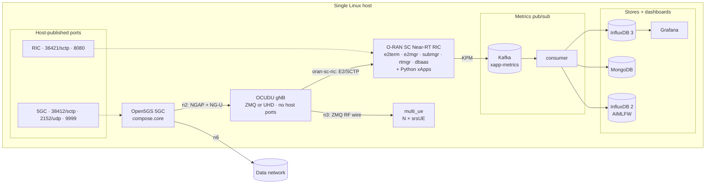
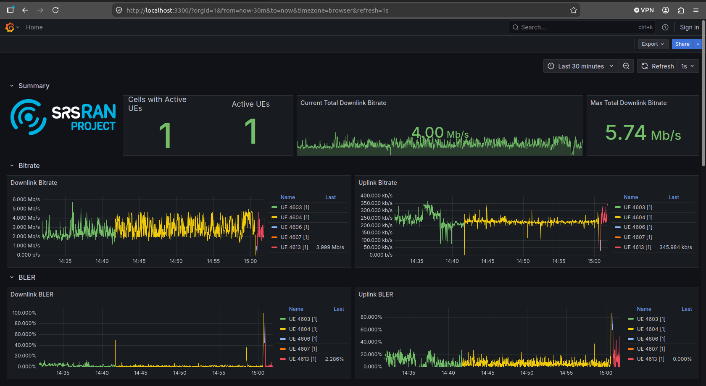
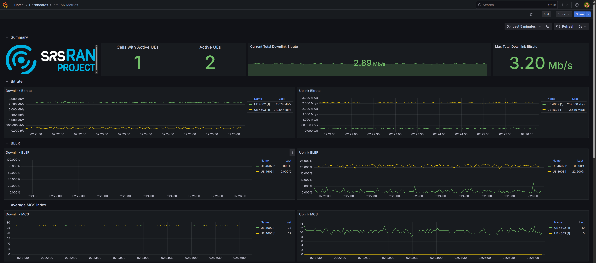
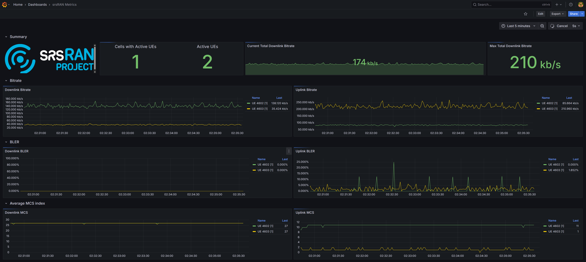

# O-RAN Testbed — Open5GS 5GC + Near-RT RIC + OCUDU/srsRAN gNB

A reproducible, single-host 5G standalone testbed packaged as **composable Docker Compose stacks**: an Open5GS 5G core, an **O-RAN SC Near-RT RIC** with Python **xApps** that monitor and control the RAN over the **E2 interface**, and an **OCUDU** (open-source CU/DU, srsRAN heritage) gNB. It runs in two RF modes — **ZMQ virtual RF** (no hardware, fully software-testable) and **UHD over-the-air RF** on a **USRP B210** SDR — and ships a **Kafka metrics pub/sub** pipeline that fans per-UE KPM into InfluxDB, MongoDB, and an AIMLFW-compatible store.

!!! abstract "At a glance"
    **Domain**: O-RAN / 5G RAN intelligence &nbsp;·&nbsp; **Repo**: [github.com/radheemCorp/oran-testbed](https://github.com/radheemCorp/oran-testbed) &nbsp;·&nbsp; **Companion**: the [Kubernetes testbed](5g-testbed.md) &nbsp;·&nbsp; **gNB**: [OCUDU](https://gitlab.com/ocudu/ocudu) (CU/DU)

## What it is
A consolidated 5G SA testbed that brings up, on one Linux host, a set of **independently composable stacks** rather than one monolithic Compose file:

- The **Open5GS** 5G core (AMF, SMF, UPF, UDM) — entrypoint provisions a subscriber and UPF NAT.
- The **O-RAN SC Near-RT RIC** — a lightweight, Kubernetes-free build of the O-RAN RIC platform — wired to the gNB over E2.
- An **OCUDU** gNB (the open-source CU/DU project with srsRAN lineage, Linux Foundation-governed) in either **ZMQ** mode (virtual RF — Docker only, ideal for development/CI) or **UHD** mode (real over-the-air RF on a **USRP B210**). A single image, built from the vendored `src/ocudu`, serves both backends.
- A multi-UE container (`N × srsUE`, ZMQ) and a **Kafka metrics pub/sub** pipeline feeding observability and ML stores.

## Decoupled architecture
The key design shift over a monolithic lab: **the 5GC and RIC publish their ports on the host**, so any number of gNBs — local, in another Compose project, or on another machine — can attach. **gNB containers publish nothing**; they reach the core/RIC over shared Docker bridge networks (and, for remote gNBs, the published host ports).

**Networks** (external bridges; `scripts/net_manage.sh init`):

| network | subnet | carries |
|---|---|---|
| `n2` | 10.53.1.0/24 | NGAP (SCTP) + NG-U GTP-U, 5GC ↔ gNB |
| `n3` | 10.10.0.0/16 | ZMQ RF transport, gNB ↔ multi_ue (*not* 3GPP N3) |
| `oran-sc-ric` | 10.0.2.0/24 | E2, gNB ↔ RIC |
| `metrics` | 172.19.1.0/24 | telemetry |

## O-RAN RIC integration
The differentiator over a plain gNB lab: a real **RIC platform** with an **E2 control loop**.

- **RIC platform services** run as containers — `e2term`, `e2mgr`, `submgr`, `rtmgr`, `dbaas` (Redis), `appmgr` — from the O-RAN SC images, on a dedicated `oran-sc-ric` network.
- The gNB connects over the **E2 (SCTP)** interface; xApps subscribe to indications and issue control through the RIC.
- **Service models** exercised:
    - **E2SM-KPM** — key performance metrics (throughput, MCS, BLER, PRB usage).
    - **E2SM-RC** — resource control (PRB ratio, slice quotas) and **handover**.
    - **E2SM-CCC** — cell configuration control.

## Metrics pub/sub pipeline
Telemetry moved from a point-to-point writer to a **broker fan-out** design so multiple sinks (dashboards, document store, ML feature store) consume the same stream independently:

- xApps publish per-UE KPM as JSON to **Kafka** (`xapp-metrics`).
- A resilient **consumer** (waits for the broker on startup, never dies on a single bad message) fans each message to:
    - **InfluxDB 3** (`srsran/kpm`) — Grafana dashboards,
    - **MongoDB** (`metrics.kpm`) — document history,
    - **InfluxDB 2** (`primary/srsran`, port 8086) — an **AIMLFW-compatible** feature source for the [O-RAN AIML framework](oran-aiml.md).

## OCUDU gNB & RF backends
- The gNB runs **OCUDU**, the permissively-licensed open-source 5G CU/DU project (full L1/L2/L3, 3GPP + O-RAN compliant). Source is vendored under `src/ocudu` so the image can be built locally.
- **One image, two RF backends** — built with `ENABLE_ZEROMQ` (virtual RF for dev/CI) and `ENABLE_UHD` (libuhd, real SDR), selected via `DEPLOY_TYPE`.
- **UHD mode** drives a **USRP B210** over USB (privileged container, `/dev/bus/usb`); `MARCH` is pinned ≤ the host CPU ISA so the PHY does not SIGILL once it runs.

## xApps (Python)
A set of xApps over the RIC E2 interface:

- `kpm_mon_xapp` — KPM metric subscription and per-UE monitoring (publishes to Kafka).
- `simple_mon_xapp` — basic indication monitor.
- `simple_rc_xapp` / `simple_rc_ho_xapp` — resource control and **handover** control.
- `simple_ccc_xapp` — cell configuration control.

## Engineering
- **Composable stacks** — `core`, `gnb (zmq|uhd)`, `ric`, `monitoring`, `pubsub` brought up independently via `scripts/manage.sh start <stack>`; `net_manage.sh` provisions the external bridges.
- **Attach-anywhere topology** — host-published 5GC/RIC ports let local *or remote* gNBs join without editing the core, decoupling RAN experiments from the core lifecycle.
- **Documented operations** — an end-to-end ZMQ runbook with gates and troubleshooting, plus per-component setup and the UHD flow.

## Key achievements
- Consolidated the testbed from a single monolithic Compose file into **composable, independently startable stacks**, and decoupled gNBs from the core via host-published ports.
- Migrated the gNB to the open-source **OCUDU** CU/DU, building **one image for both ZMQ and UHD** RF backends.
- Established a working **O-RAN E2 control loop**: Python xApps subscribing to live KPM indications and issuing RC / CCC control to the gNB.
- Re-architected telemetry into a **Kafka pub/sub** pipeline fanning per-UE KPM to **InfluxDB 3, MongoDB, and an AIMLFW-compatible InfluxDB 2** — moving toward ML-driven RAN control.
- Demonstrated **real over-the-air 5G** with a **USRP B210** SDR — sustained ~4 Mb/s downlink video to a UE (peak 5.74 Mb/s) — and **end-to-end user-plane traffic** between UEs in ZMQ mode (iperf + VoIP-style flows).

## Experiments & results
Workloads run end-to-end across both RF modes and observed live in the Grafana dashboards.

<figure markdown>
  { loading=lazy }
  <figcaption>UHD over-the-air mode: live video streaming to a UE via a USRP B210 SDR, ~4 Mb/s downlink (peak 5.74 Mb/s) on the Grafana dashboard.</figcaption>
</figure>

<figure markdown>
  { loading=lazy }
  <figcaption>ZMQ mode: iperf throughput between two attached UEs — downlink/uplink bitrate, BLER, and MCS index per UE.</figcaption>
</figure>

<figure markdown>
  { loading=lazy }
  <figcaption>ZMQ mode: sustained low-bitrate VoIP-style traffic between two UEs (~174 kb/s), exercising steady-state RAN behavior.</figcaption>
</figure>

## Tech stack
`Open5GS` · `O-RAN SC Near-RT RIC` · `OCUDU` (CU/DU) · `srsRAN` heritage · `E2 / E2AP` · `E2SM-KPM` · `E2SM-RC` · `E2SM-CCC` · `Python (xApps)` · `Kafka` · `InfluxDB 2/3` · `MongoDB` · `Telegraf` · `Grafana` · `Docker` · `Docker Compose` · `ZMQ` · `UHD / USRP B210` · `iperf`
