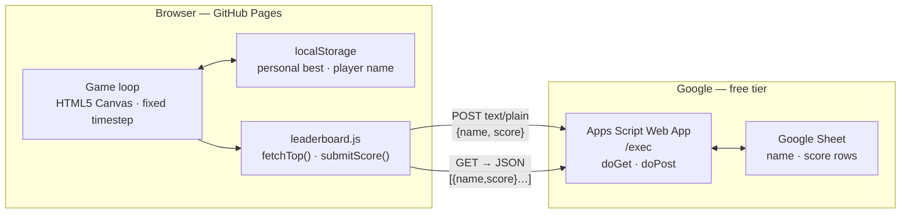
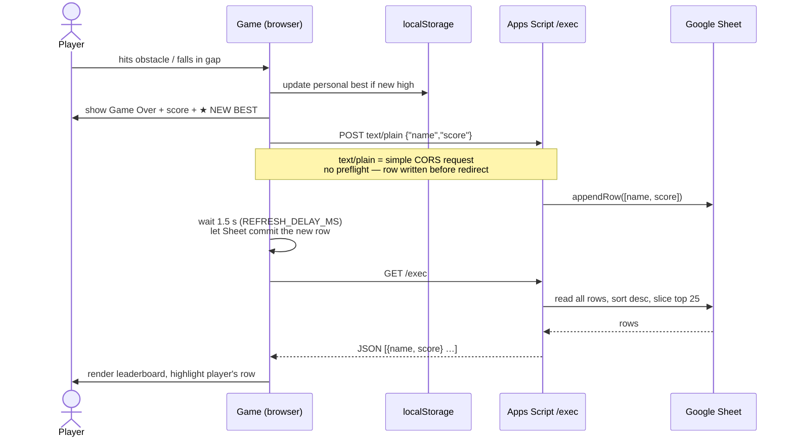

# Infinite Stickman — Arcade Runner

An endlessly scrolling monochrome arcade runner built with **Vanilla JS and HTML5 Canvas** — no framework, no build step, zero dependencies. A global leaderboard is powered by **Google Sheets + Apps Script**, so scores are stored and served without any backend to host or maintain.

!!! abstract "At a glance"
    **Role**: Full-stack engineer (solo) &nbsp;·&nbsp; **Stack**: Vanilla JS · HTML5 Canvas · Google Apps Script · Google Sheets · GitHub Pages &nbsp;·&nbsp; **Hosting cost**: $0

    **Play**: [radheem.github.io/stickman](https://radheem.github.io/stickman/) &nbsp;·&nbsp; **Repo**: [github.com/radheem/stickman](https://github.com/radheem/stickman)

## Screenshots

*Enter your name — it goes on the global leaderboard.*

*Jump gaps, clear obstacles, duck under overhead pillars. Speed climbs the longer you survive.*

*Die and your score is submitted instantly. A new personal best is marked ★. Your row is highlighted on the board.*

## Architecture

## Highlights

- Built a **fixed-timestep game loop at 120 Hz** with render interpolation — physics and game logic are decoupled from frame rate, so the game runs identically on any display refresh rate.
- Implemented **arcade-grade jump feel**: coyote time (jump grace after walking off an edge), jump buffering (input registered before landing), variable jump height (release early = lower arc), and a double jump — all with tunable parameters in a single `config.js`.
- Designed a **procedural world generator** with object-pooled, recycled terrain chunks — memory stays bounded regardless of run length, verified over multi-minute sessions.
- Every hazard (gap, triangle, stacked block, overhead pillar) is **physics-checked for solvability** before it appears — the game is never unfair by generation.
- Built a **serverless global leaderboard** using Google Sheets as the database and a Google Apps Script web app as the API — no backend to host, no API keys, no auth.
- Solved the **Apps Script CORS constraint** cleanly: `submitScore` sends `Content-Type: text/plain` instead of `application/json`, making it a CORS "simple request" with no preflight (Apps Script cannot answer `OPTIONS`). The body is JSON regardless; `doPost` parses `e.postData.contents` directly.
- Used a **run-ID guard** to cancel stale leaderboard fetches on restart — if a player dies and immediately restarts, the in-flight fetch from the previous run is discarded.
- Deployed to **GitHub Pages** with a zero-config GitHub Actions workflow — push to `main` and the game is live.

## Game Over — Leaderboard Flow

## Engine Design

| Feature | Detail |
|---|---|
| **Rendering** | HTML5 Canvas; fixed 16:9 virtual resolution scaled-to-fit with letterbox; DPR-aware for sharp rendering on HiDPI screens |
| **Game loop** | Fixed 120 Hz timestep; render interpolation for smooth motion at any display FPS |
| **Physics** | Arcade gravity; AABB collision; fall-into-gap detection |
| **Jump** | Coyote time · jump buffering · double jump · variable height |
| **World** | Object-pooled terrain chunks; seedable PRNG; procedural gaps + obstacles |
| **Difficulty** | Linear speed ramp; hazard difficulty gates; reaction window tightens with speed |
| **Leaderboard** | Google Sheets backend via Apps Script; `text/plain` POST (no CORS preflight); run-ID guard for stale fetch cancellation; snapshot fallback on endpoint failure |
| **Score** | Distance-based; ticks proportionally to distance survived; personal best in localStorage |

## Tech Stack
`Vanilla JavaScript (ES modules)` · `HTML5 Canvas` · `Google Apps Script` · `Google Sheets` · `GitHub Actions` · `GitHub Pages`
