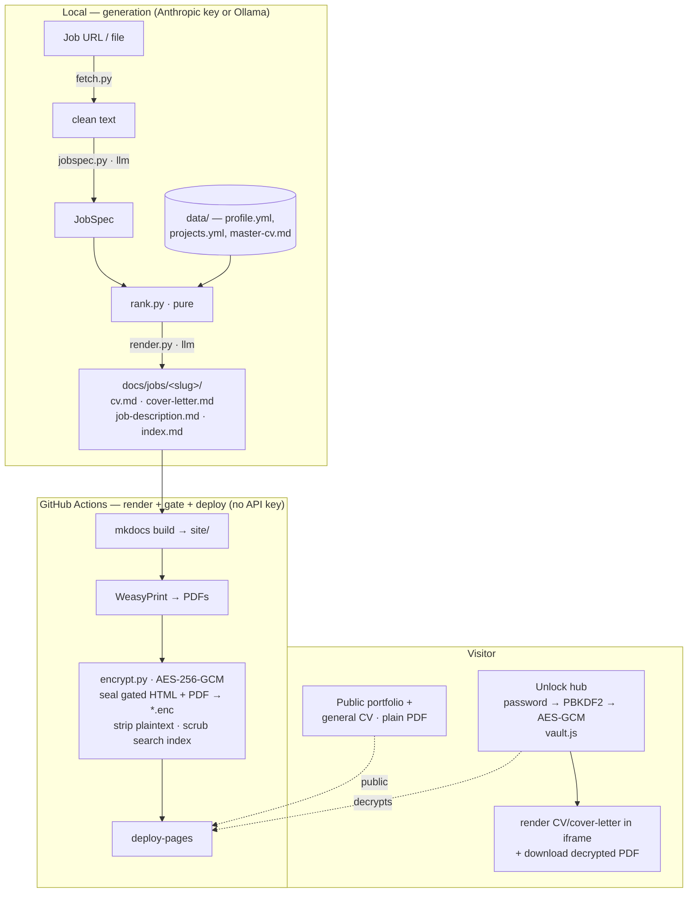
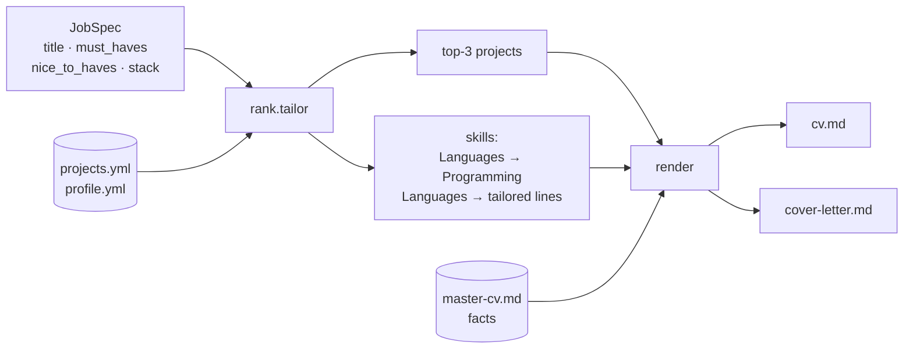
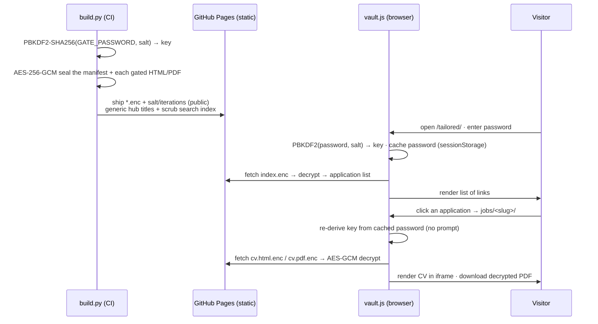

# Architecture

cv-tailor has a deliberate split: **content generation runs locally** (it costs money
and needs review), while **rendering, gating, and deploying run in CI** with no API key.
Committed Markdown is the handoff between the two.

## The two halves

| | Generation (`engine/`) | Render + gate (`build.py`, CI) |
|---|---|---|
| Runs | locally, on demand | in GitHub Actions on push |
| Needs | Anthropic key **or** local Ollama | `GATE_PASSWORD` secret |
| Input | a job posting | committed Markdown under `docs/` |
| Output | tailored Markdown | the deployed, gated site |

Keeping them apart means API cost and a human review stay out of CI, and CI never holds a
model key. The provider lives behind `engine/llm.py`: **Anthropic** by default (the
`anthropic` SDK, `claude-sonnet-4-6`), or a local **Ollama** / OpenAI-compatible endpoint
(the `openai` SDK, `qwen3.5:35b`) with `--provider ollama`. One provider per run, model
chosen with `--model`; `jobspec.py` and `render.py` are provider-agnostic. See the
[CLI reference](cli.md) for the full flag/env surface.

## Generation pipeline

`cv-tailor new <job-url-or-file>`:

1. **`fetch.py`** → clean job text (URL via Playwright, or read a pasted `.txt`/`.md`).
2. **`jobspec.py`** → a structured **JobSpec** via `llm.structured_json` (json-schema
   constrained). This is the contract between the LLM half and the pure half.
3. **`rank.py`** → the **top-3 projects** and the ordered **skills block**. This is a
   pure function — no I/O, no LLM — so it is unit-tested with fixtures
   ([tests/test_rank.py](https://github.com/johndoe/cv-tailor)). It scores projects by token
   overlap (with tag **aliasing**, e.g. `k8s→kubernetes`), **cluster affinity**, and a
   per-project **weight**, all steered by version-controlled `data/taxonomy.yml` +
   `data/ranking.yml`. The same taxonomy classifies the JobSpec into `clusters`, written into
   the job hub's front matter so jobs and projects share one vocabulary. All config is optional
   and **default-inert** — absent files reproduce the original token-overlap ranking.
4. **`render.py`** → tailored `cv.md` + `cover-letter.md` via `llm.stream_text`, writing
   prose *around* the already-chosen projects/skills. It never picks them.

The ranking rules: **top-3 most-relevant projects** (keyword/stack overlap, must-haves
weighted highest), and a skills block ordered **Languages → Programming Languages →
1-3 job-tailored technical lines**, each led by the JD's must-haves.

## The gate (static-safe)

GitHub Pages serves only static files, so the password can't be a server secret — anything
shipped is inspectable. Instead the entire Tailored section sits behind **one sign-in page**:
the gated documents — and the very list of applications — are **encrypted at build time** and
decrypted **in the browser**. The only public "Tailored" entry is the landing page; it leaks
no role or company names because the manifest of applications is itself ciphertext.

Key points:

- **One sign-in, then browse.** The password is cached in `sessionStorage` (salt-scoped, per
  tab — never the raw key) so each per-job hub auto-unlocks. A direct visit to a per-job URL
  with no cached password still shows its own prompt.
- **Nothing leaks pre-sign-in.** Application titles/companies live only inside the encrypted
  manifest; the landing page and the per-job hubs carry a generic heading and `search:
  exclude`, so neither the HTML nor the search index exposes which roles exist.
- **The password is never in the bundle** — only ciphertext, the salt, and the iteration
  count ship. Brute-force resistance rests on password strength + PBKDF2 iterations.
- **PDFs are encrypted too.** Because WeasyPrint pre-renders them, an unencrypted PDF would
  sit at a public URL and bypass the gate — so each gated PDF is sealed as a blob and
  decrypted client-side on download.
- **No plaintext leaks.** `build.py` deletes the plaintext gated pages from `site/` and
  scrubs the MkDocs search index of gated entries (gated pages also carry
  `search: exclude` front matter).
- Blob format is `base64( iv[12] || ciphertext‖GCM-tag )`, matching `encrypt.seal()` and
  `vault.js` byte-for-byte.

## Document rendering

The CV and cover letter are **not** rendered through the MkDocs Material theme — that
produced web-styled, multi-page output and leaked theme chrome into the unlock iframe.
Instead, `engine/documents.py` renders each gated document as **standalone HTML with
`docs/assets/doc.css` inlined**: a classic one-column CV (small-caps ruled headings,
two-line entries) and a minimal business letter (letterhead → date → salutation → body →
sign-off, no title). The cover-letter salutation is `Dear {recipient},` when a recipient is
set, else `Dear Hiring Team,`. The **same** self-contained HTML feeds both the WeasyPrint
PDF and the in-browser view, so they match and need no external assets. The gated sources
are excluded from the mkdocs build (`exclude_docs`) so nothing themed is ever produced.

## Repository layout

| Path | Role |
|---|---|
| `data/` | source of truth — `master-cv.md` (facts), `profile.yml`, `projects.yml`, guides |
| `engine/rank.py` | **pure** ranking — unit-tested |
| `engine/jobspec.py`, `engine/render.py` | Claude API calls (local only) |
| `engine/cli.py`, `engine/fetch.py` | `cv-tailor new` entrypoint + job fetcher |
| `docs/` | MkDocs content; `docs/jobs/<slug>/` is gated |
| `engine/documents.py`, `docs/assets/doc.css` | standalone, theme-independent CV/letter HTML + print CSS |
| `build.py`, `encrypt.py` | render PDFs + AES-seal the gated content |
| `docs/assets/vault.js` | in-browser PBKDF2 + AES-GCM decryptor |
| `.github/workflows/deploy.yml` | render → gate → deploy to Pages |

See [Setup](setup.md) to run it end to end.
