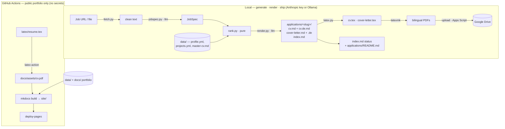

# Architecture

A deliberate split: **content generation + rendering run locally** (they cost money, need
review, and need an LLM / LaTeX), while **CI only builds the public portfolio**. Tailored
documents never touch the public site — they go to Google Drive, and their status is tracked in
git.



## The two halves

| | Generation + rendering (`engine/`, `latex/`) | Publish (CI) |
|---|---|---|
| Runs | locally, on demand | GitHub Actions on push |
| Needs | LLM (Anthropic key or local Ollama) + LaTeX (latexmk / Docker) | nothing — no secrets |
| Output | bilingual PDFs → Drive; status in git | the public portfolio + the generic CV PDF |

The privacy guarantee is **structural**: `applications/` lives outside `docs/`, so `mkdocs build`
never sees it — no company name can appear in the site, sitemap, or search index. (This replaces
the old encrypted-gate design entirely.)

## Generation pipeline

`cv-tailor new <job-url-or-file>`:

1. **`fetch.py`** → clean job text (URL via Playwright, or a pasted `.txt`/`.md`).
2. **`jobspec.py`** → a structured **JobSpec** via `llm.structured_json` (json-schema constrained).
3. **`rank.py`** → the **top-3 projects** and the ordered **skills block**. Pure, no I/O, no LLM —
   unit-tested. Scores by token overlap (with tag aliasing `k8s→kubernetes`), **cluster affinity**,
   and per-project **weight**, steered by `data/taxonomy.yml` + `data/ranking.yml` (optional,
   default-inert). The same taxonomy writes the job's `clusters` into `index.md`.
4. **`render.py`** → tailored `cv.md` + `cover-letter.md` (prose around the chosen projects/skills;
   never picks them), then a German **translation pass** → `cv.de.md` / `cover-letter.de.md`.

## Markdown → LaTeX (the renderer)

`engine/latex.py` deterministically turns the LLM's Markdown into LaTeX for the
`resume` template — **the model never emits LaTeX**, so escaping and structure are always valid.

```mermaid
flowchart LR
    EN[cv.md / cover-letter.md] --> R[latex.py]
    DE[cv.de.md / cover-letter.de.md] --> R
    PROJ[(projects.yml — page URLs)] --> R
    R --> TEX[.tex\nEN page + \\clearpage\\selectlanguage{ngerman} + DE page]
    TEX --> MK[latexmk → 2-page PDF]
```

- Maps the known CV structure onto the class macros — `## Experience`→`\section`, `### Org — Role`
  + `*loc · dates*`→`\role`, bullets→`\bullets`, `## Projects`→`\project{name}{url}{desc}` (URLs
  resolved from `projects.yml`, reused positionally for the German page), `## Skills`→`\item`.
- Cover letter: `\senderblock` + `\recipient` + `\opening` + paragraphs + `\closing`, English then
  German (salutation `Dear …,` / `Sehr geehrte…,`).
- Compiled by `scripts/build-application.sh` (local `latexmk`, else the `texlive/texlive` Docker
  image). The shared classes live in `latex/` and are resolved via `TEXINPUTS`.

## Application records & status

Each `applications/<slug>/index.md` carries `job_title`, `company`, `status`, `clusters`,
`drive_url`, `drive_updated` in its front matter. `cv-tailor status` edits `status` and refreshes
`applications/README.md` (the at-a-glance tracker table). **Git is the tracker** — commits + dates
are the audit trail; the bilingual PDFs themselves live in Google Drive (one folder per slug,
created by the Apps Script uploader running as the user).

## Repository layout

| Path | Role |
|---|---|
| `data/` | source of truth — `master-cv.md`, `profile.yml`, `projects.yml`, guides, prompts |
| `engine/rank.py` | **pure** ranking — unit-tested |
| `engine/jobspec.py`, `engine/render.py` | LLM calls (local only) incl. German translation |
| `engine/latex.py` | deterministic Markdown → LaTeX (bilingual) |
| `engine/cli.py`, `engine/fetch.py` | CLI entrypoint + job fetcher |
| `latex/` | `resume.cls`, `coverletter.cls`, `resume.tex` (public CV) |
| `scripts/build-application.sh` | compile an app's `.tex` → PDFs |
| `apps-script/Code.gs` | Google Drive uploader (`doPost`, owner-run) |
| `applications/<slug>/` | one dir per application (md + `.tex` + `index.md`); PDFs gitignored |
| `docs/` | the **public** portfolio (never holds applications) |
| `.github/workflows/deploy.yml` | compile public CV + `mkdocs build` → Pages |

See [Setup](setup.md) to run it end to end.
