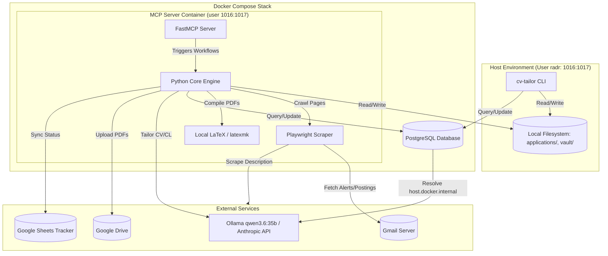
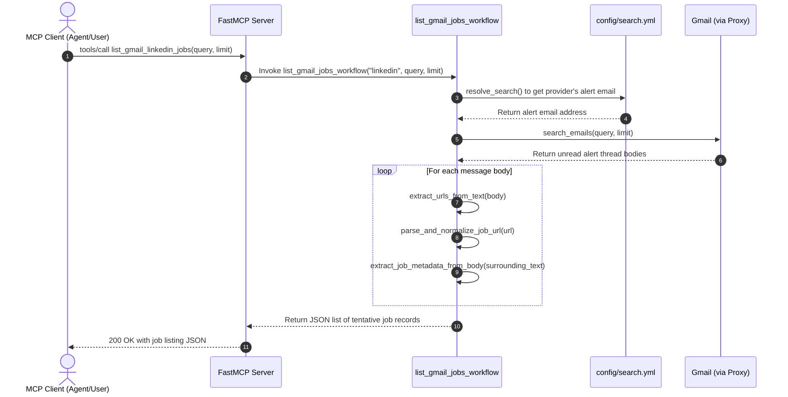
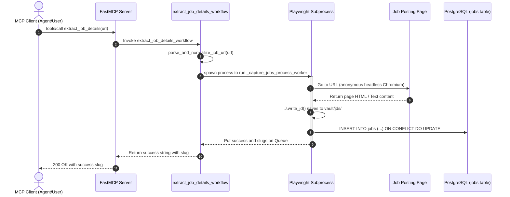
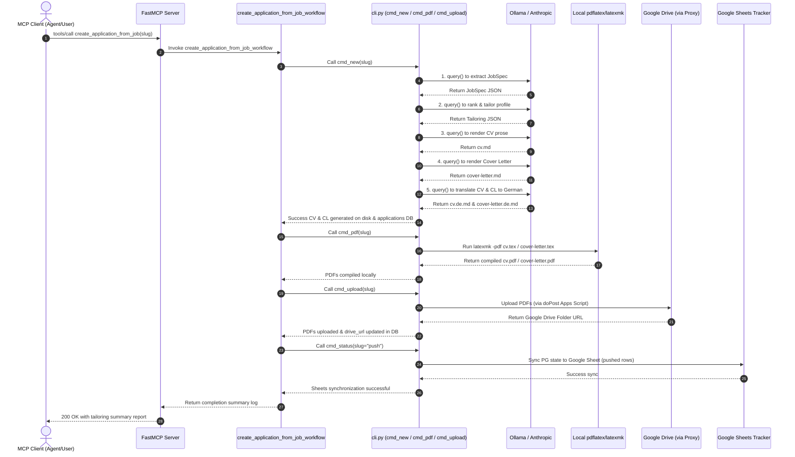

# Architecture

A deliberate split: **content generation + rendering run locally** (they cost money, need
review, and need an LLM / LaTeX), while **CI only builds the public portfolio**. Tailored
documents never touch the public site — they go to Google Drive, and their status is tracked in
git.



## The two halves

| | Generation + rendering (`engine/`, `latex/`) | Publish (CI) |
|---|---|---|
| Runs | locally, on demand | GitHub Actions on push |
| Needs | LLM (Anthropic key or local Ollama) + LaTeX (latexmk / Docker) | nothing — no secrets |
| Output | bilingual PDFs → Drive; status in git | the public portfolio + the generic CV PDF |

The privacy guarantee is **structural**: `applications/` lives outside `docs/`, so `mkdocs build`
never sees it — no company name can appear in the site, sitemap, or search index. (This replaces
the old encrypted-gate design entirely.)

## Generation pipeline

`cv-tailor new <job-url-or-file>`:

1. **`fetch.py`** → clean job text (URL via Playwright, or a pasted `.txt`/`.md`).
2. **`jobspec.py`** → a structured **JobSpec** via `llm.structured_json` (json-schema constrained).
3. **`rank.py`** → the **top-3 projects** and the ordered **skills block**. Pure, no I/O, no LLM —
   unit-tested. Scores by token overlap (with tag aliasing `k8s→kubernetes`), **cluster affinity**,
   and per-project **weight**, steered by `data/taxonomy.yml` + `data/ranking.yml` (optional,
   default-inert). The same taxonomy writes the job's `clusters` into `index.md`.
4. **`render.py`** → tailored `cv.md` + `cover-letter.md` (prose around the chosen projects/skills;
   never picks them), then a German **translation pass** → `cv.de.md` / `cover-letter.de.md`.

## Markdown → LaTeX (the renderer)

`engine/latex.py` deterministically turns the LLM's Markdown into LaTeX for the
`resume` template — **the model never emits LaTeX**, so escaping and structure are always valid.

```mermaid
flowchart LR
    EN[cv.md / cover-letter.md] --> R[latex.py]
    DE[cv.de.md / cover-letter.de.md] --> R
    PROJ[(projects.yml — page URLs)] --> R
    R --> TEX[.tex\nEN page + \\clearpage\\selectlanguage{ngerman} + DE page]
    TEX --> MK[latexmk → 2-page PDF]
```

- Maps the known CV structure onto the class macros — `## Experience`→`\section`, `### Org — Role`
  + `*loc · dates*`→`\role`, bullets→`\bullets`, `## Projects`→`\project{name}{url}{desc}` (URLs
  resolved from `projects.yml`, reused positionally for the German page), `## Skills`→`\item`.
- Cover letter: `\senderblock` + `\recipient` + `\opening` + paragraphs + `\closing`, English then
  German (salutation `Dear …,` / `Sehr geehrte…,`).
- Compiled by `scripts/build-application.sh` (local `latexmk`, else the `texlive/texlive` Docker
  image). The shared classes live in `latex/` and are resolved via `TEXINPUTS`.

## Application records, status & database

The absolute source of truth for all application metadata, raw job descriptions, and tailored CV/letter text is a local **PostgreSQL 17 database** (running in Docker Compose). 

While final generated files reside under `applications/<slug>/` on disk, status transitions and syncing are backed by PostgreSQL:
- **Bi-directional Sync**: `make db-push` and `make db-pull` allow syncing text content between local files and the database.
- **Sheets Sync**: `make sheet-push` and `make sheet-pull` synchronize statuses with Google Sheets directly from the database by joining schemas.
- **Seen Jobs**: The PostgreSQL `jobs` table replaces all legacy JSON seen files, providing bulletproof deduplication.
- **Flat Backups**: `make db-export` dumps the complete database tables, job logs, and markdown files back to disk at `/application-data/` for version control.

## Repository layout

| Path | Role |
|---|---|
| `data/` | source of truth — `master-cv.md`, `profile.yml`, `projects.yml`, guides, prompts |
| `engine/rank.py` | **pure** ranking — unit-tested |
| `engine/jobspec.py`, `engine/render.py` | LLM calls (local only) incl. German translation |
| `engine/latex.py` | deterministic Markdown → LaTeX (bilingual) |
| `engine/cli.py`, `engine/fetch.py` | CLI entrypoint + job fetcher |
| `engine/db.py` | PostgreSQL database connection, initializations, and legacy migrations |
| `engine/mcp/` | Model Context Protocol (MCP) server for secure database open-queries |
| `latex/` | `resume.cls`, `coverletter.cls`, `resume.tex` (public CV) |
| `scripts/build-application.sh` | compile an app's `.tex` → PDFs |
| `apps-script/Code.gs` | Google Drive uploader (`doPost`, owner-run) |
| `applications/<slug>/` | one dir per application (md + `.tex` + `index.md`); PDFs gitignored |
| `docs/` | the **public** portfolio (never holds applications) |
| `.github/workflows/deploy.yml` | compile public CV + `mkdocs build` → Pages |

## Model Context Protocol (MCP) Server

To enable fully autonomous, conversational job hunt metrics and application tracking, the project embeds a PostgreSQL **Model Context Protocol (MCP) Server**. 

Using a strict, comment-aware `sqlguard` whitelisting query parser, the server exposes two powerful tools to AI agents:
1.  **`cv_tailor_ontology()`**: Exposes the table layouts, columns, types, and FK joins of our schema so agents understand the database out-of-the-box.
2.  **`query(sql)`**: Evaluates read-only `SELECT` / `WITH` statements, preventing SQL injection or mutations, and capping return records to a hard 1000-row limit.

Start the server locally or wire it into your desktop clients via:
```bash
make mcp
```

See [Setup](setup.md) to run it end to end.

---

## Workflow Sequence Diagrams

These sequence diagrams detail the end-to-end execution path for each of our core modular workflows, illustrating their specific purposes and interactions with external resources.

### 1. Gmail Alert Job Listing Workflow (`list_gmail_[provider]_jobs`)
*   **Purpose:** To securely query your Gmail inbox via the Apps Script API Proxy for unread job alert emails from a specified provider (LinkedIn, Glassdoor, or Indeed) using specialized tools (`list_gmail_linkedin_jobs`, `list_gmail_glassdoor_jobs`, `list_gmail_indeed_jobs`), parse their bodies to extract target links, normalize them, and compile a clean, lightweight list of newly discovered postings with tentative metadata (including `job_id`, `company`, `role`, and `brief_description`) without executing any heavy web-scraping or modifications.



---

### 2. Ad-hoc Job Scraping Workflow (`extract_job_details`)
*   **Purpose:** To take a specific job posting URL, validate and normalize it, spawn a Chromium Playwright browser in a clean, isolated subprocess (to completely isolate standard input/output streams and prevent MCP console channel noise), bypass any anti-bot or session hurdles, scrape the full job description, write a file-system backup, and commit the complete record securely to our PostgreSQL database `jobs` table for future scoring and application tailoring.



---

### 3. Bilingual Tailoring & Application Upload Workflow (`create_application_from_job`)
*   **Purpose:** To execute the downstream application compilation and tracking process for an ingested job slug. It triggers LLM queries to parse the JobSpec, adapts your master resume structure, and writes tailored English and German Markdown packages on disk and to the `applications` database. It then compiles them locally using the containerized LaTeX engine to create polished PDFs, uploads them to your secure Google Drive, and instantly pushes the tracking status to Google Sheets.


