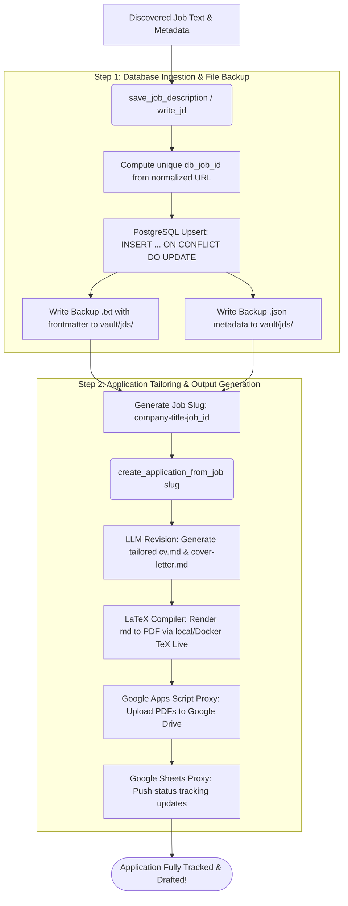
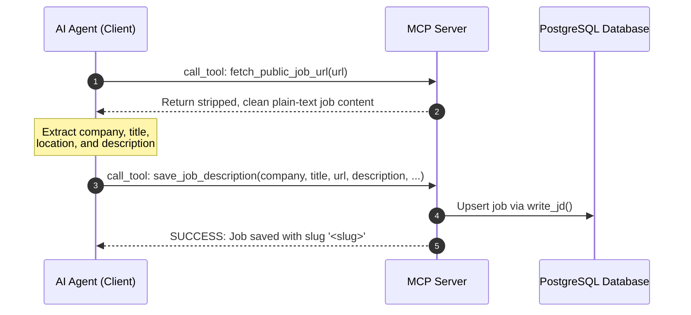
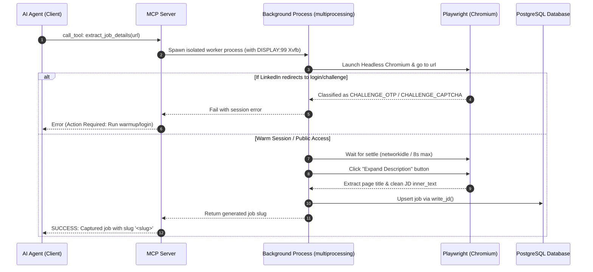

# Specification & Guide: Composable Ingestion and Application Flow

This document outlines the architecture, supported flows, and execution pipelines of the `cv-tailor` Model Context Protocol (MCP) server. By segregating the browser-based scraping from direct HTTP fetching and persistence, the system achieves a highly composable and robust workflow.

---

## 1. Core Architecture
Regardless of *how* the job description text is obtained (via Gmail alerts, a Playwright browser crawler, manual text pasting, or direct HTTP fetching), all flows ultimately converge on a single, unified database persistence and application tailoring pipeline.

---

## 2. Supported Ingestion Flow Paths

### Path A: Direct Public Ingestion (Preferred & Standard Path)
*Highly recommended for public/unauthenticated links or platforms (like Glassdoor or Indeed) where browser crawlers hit anti-bot walls.*

### Path B: Authenticated Browser Crawler (Playwright Path)
*Specifically used for scraping complex pages (like LinkedIn) where public pages are heavily restricted and active logged-in cookies are required.*

---

## 3. Comparison Matrix

| Property | Path A (Direct Public Ingester) | Path B (Authenticated Scraper) |
| :--- | :--- | :--- |
| **Primary Use Case** | Public job links, Indeed/Glassdoor, custom websites, copy-pastes | Scraped LinkedIn pages requiring a logged-in session |
| **Speed** | 2–5 seconds (Extremely fast) | 20–40 seconds (Heavy browser overhead) |
| **Anti-Bot Resistance** | High (completely avoids driving a browser) | Prone to CAPTCHAs, requires session maintenance |
| **Failure Rate** | Low (Direct ingestion, highly reliable) | High on unauthenticated pages (timeouts) |
| **Requires Display/X11** | No (Pure Python & HTTP) | Yes (runs in virtual framebuffer Xvfb inside Docker) |
