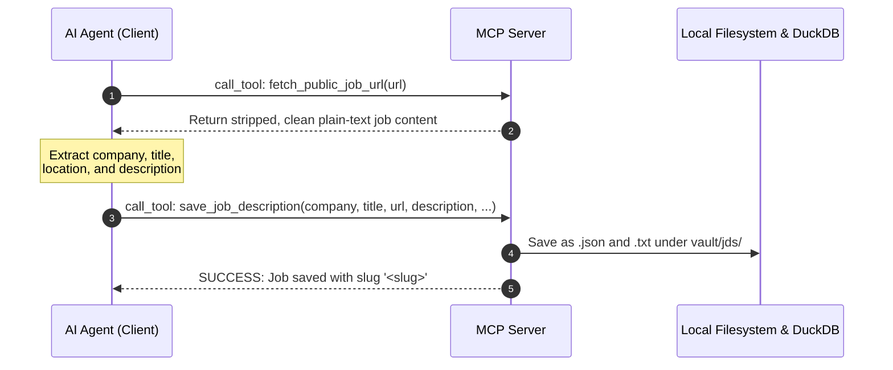
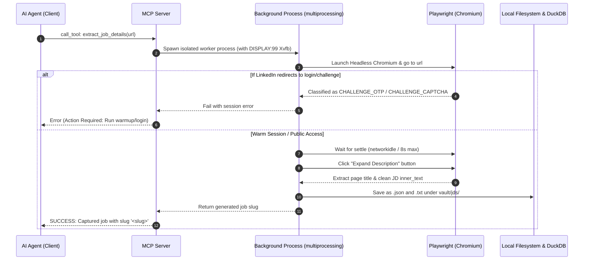

# Specification & Guide: Composable Ingestion and Application Flow

This document outlines the architecture, supported flows, and execution pipelines of the `cv-tailor` Model Context Protocol (MCP) server. By segregating the browser-based scraping from direct HTTP fetching and persistence, the system achieves a highly composable and robust workflow.

---

## 1. Core Architecture
Regardless of *how* the job description text is obtained (via Gmail alerts, a Playwright browser crawler, manual text pasting, or direct HTTP fetching), all flows ultimately converge on a single, unified database persistence and application tailoring pipeline.

---

## 2. Supported Ingestion Flow Paths

### Path A: Direct Public Ingestion (Preferred & Standard Path)
*Highly recommended for public/unauthenticated links or platforms (like Glassdoor or Indeed) where browser crawlers hit anti-bot walls.*

### Path B: Authenticated Browser Crawler (Playwright Path)
*Specifically used for scraping complex pages (like LinkedIn) where public pages are heavily restricted and active logged-in cookies are required.*

---

## 3. Comparison Matrix

| Property | Path A (Direct Public Ingester) | Path B (Authenticated Scraper) |
| :--- | :--- | :--- |
| **Primary Use Case** | Public job links, Indeed/Glassdoor, custom websites, copy-pastes | Scraped LinkedIn pages requiring a logged-in session |
| **Speed** | 2–5 seconds (Extremely fast) | 20–40 seconds (Heavy browser overhead) |
| **Anti-Bot Resistance** | High (completely avoids driving a browser) | Prone to CAPTCHAs, requires session maintenance |
| **Failure Rate** | Low (Direct ingestion, highly reliable) | High on unauthenticated pages (timeouts) |
| **Requires Display/X11** | No (Pure Python & HTTP) | Yes (runs in virtual framebuffer Xvfb inside Docker) |

---

## 4. System Workflows Behind Each MCP Tool Call

This section documents the exact, backend system-level execution flows behind each Model Context Protocol (MCP) tool call.

### 0. Handshake & Core Context Loader
*Exposed as: `initialize_agent_session`*
* **Trigger:** Initializing an agent session on turn 1 to load instructions and facts.
* **Backend Flow:**
  1. Locates and parses the user's factual profile from `data/profile.yml`.
  2. Reads the full written career history from `data/master-cv.md`.
  3. Retrieves the troubleshooting, pacing, and rate limit rules from `data/guides/mcp-insights.md`.
  4. Combines the profile, CV, and insights with a strict, structured Operational Mental Model explaining how to correctly orchestrate the ingestion trilogy, tool selection guidelines, and queue mechanics.
  5. Serializes and returns this context package in under 1 second as a single structured JSON response.

### 1. Gmail Alert Ingestion Tools
*Exposed as: `list_gmail_linkedin_jobs`, `list_gmail_indeed_jobs`, `list_gmail_glassdoor_jobs`, `list_gmail_fraunhofer_jobs`*
* **Trigger:** Initiating Step 1 (Gmail Discovery Path) of the job application pipeline.
* **Backend Flow:**
  1. Connects securely to the Google Apps Script proxy API using credentials loaded from `.env`.
  2. Queries Gmail using provider-specific queries (e.g., `from:donotreply@jobalert.indeed.com is:unread`).
  3. Parses the raw email body text to locate potential job postings.
  4. Normalizes URLs to extract platform-specific job IDs using `parse_and_normalize_job_url`.
  5. Compiles and returns a lightweight JSON array of newly discovered jobs containing tentative `job_id`, `company`, `role`, `job_url`, and a brief description snippet without modifying any database state.

### 2. Specialized Platform Guest API Fetchers
*Exposed as: `fetch_linkedin_job`, `fetch_indeed_job`*
* **Trigger:** Direct fetching of job postings using known IDs (obtained via Gmail alerts or URL extraction) instead of heavy Playwright scraping.
* **Backend Flow:**
  1. Accepts a unique platform `job_id` (such as Indeed's `jk` or LinkedIn's guest ID).
  2. Constructs the canonical public API/direct view URL templates:
     * **LinkedIn:** `https://www.linkedin.com/jobs-guest/jobs/api/jobPosting/{job_id}`
     * **Indeed:** `https://de.indeed.com/viewjob?jk={job_id}`
  3. Dispatches a standard HTTP request using `urllib.request` with a realistic desktop `User-Agent` string.
  4. Parses the response content based on the platform:
     * **LinkedIn (HTML):** Strips head, script, and style tags, formats blocks into structured line breaks, and returns clean plain text via `_clean_html()`.
     * **Indeed (JSON or HTML Fallback):** Attempts parsing as JSON first, returning a pretty-printed JSON string if successful. If JSON decoding fails, falls back gracefully to treating it as HTML and parsing text via `_clean_html()`.
  5. Gracefully handles network/HTTP errors (e.g., 403 Forbidden) and returns clean error strings to prevent calling agent failures.

### 3. Generic Guest Fetcher
*Exposed as: `fetch_public_job_url`*
* **Trigger:** Reading unstructured job descriptions directly from general public websites.
* **Backend Flow:**
  1. Opens a standard HTTP stream with `urllib.request` using custom headers.
  2. Retrieves and decodes HTML content to UTF-8.
  3. Feeds the HTML string into a central `_clean_html()` parser:
     * Strips structural boilerplate: `<script>`, `<style>`, `<head>`, `<header>`, `<footer`, `<nav>`.
     * Replaces layout tags (e.g. `
`, `
`, ` `, `<li>`) with structured line breaks.
     * Strips remaining HTML tags, unescapes characters (`&amp;` to `&`), and collapses redundant whitespace.
  4. Returns the clean, readable plain text of the job description.

### 4. Direct Database Ingest & File Backup
*Exposed as: `save_job_description`*
* **Trigger:** Persisting discovered job metadata and description to system storage before starting application tailoring.
* **Backend Flow:**
  1. Accepts `company`, `title`, `url`, `description`, `location`, and optional metadata.
  2. Hashes the URL using MD5 to compute a stable, unique 12-character `job_id`.
  3. Resolves/generates a unique human-readable `slug` (e.g., `company-title-job_id`).
  4. Writes local files (`<slug>.txt` with frontmatter and `<slug>.json` metadata) to the filesystem in `vault/jds/`.
  5. The local files are automatically registered by the serverless DuckDB cache for scoring and querying.
  6. Returns the generated unique job `slug` to the caller.

### 5. Asynchronous Tailoring Engine
*Exposed as: `create_application_from_job`*
* **Trigger:** Initiating application creation (CV/Cover Letter rendering) for an ingested job.
* **Backend Flow:**
  1. Accepts a unique job `slug`.
  2. Verifies that the corresponding job description files exist under `vault/jds/`.
  3. Updates the job state directly in the local `index.md` frontmatter, setting status to `'queued'`.
  4. Pushes the job slug to a global, thread-safe in-memory FIFO Queue (`_tailor_queue`).
  5. A dedicated serial consumer background thread pops the job, advances the state in the local frontmatter to `'generating'`, and runs the LLM tailoring engine to produce tailored CV + Cover Letter Markdown files.
  6. Compiles LaTeX documents locally (using standard `latexmk` or inside a TeX Live container) to generate high-quality English/German PDFs.
  7. Uploads the finalized packages to Google Drive via an Apps Script proxy.
  8. Synchronizes the application status back to the Google Sheets tracker.
  9. Marks the application state in `index.md` as `'draft'` (or `'failed'` on crash).

