# 5G srsRAN Testbed — Network Virtualization (Kubernetes)

A Kubernetes-orchestrated, end-to-end 5G standalone testbed integrating **srsRAN** (RAN) and **Open5GS** (core), with multi-homed pod networking, an integrated **O-RAN Near-RT RIC**, host-based UEs over virtual RF, and an SDN-managed transport network.

!!! abstract "At a glance"
    **Domain**: 5G network virtualization / NFV &nbsp;·&nbsp; **Repo**: [github.com/radheemCorp/srsRAN-dep-zmq](https://github.com/radheemCorp/srsRAN-dep-zmq) &nbsp;·&nbsp; **Result**: 50+ Mbps TCP throughput, validated UE-to-UE hairpin routing via UPF &nbsp;·&nbsp; **Reference**: [sulaimanalmani/k8s_srsran_open5gs](https://github.com/sulaimanalmani/k8s_srsran_open5gs)

> A single-host Docker-Compose sibling of this testbed is documented in [5G srsRAN + O-RAN RIC (Docker)](srsran-docker.md). This page covers the **Kubernetes** orchestration with Multus CNI, ONOS SDN, and host-UE bridging.

## Architecture

```mermaid
flowchart TB
  subgraph host[Linux host]
    subgraph ue[Host UEs &#40;Docker + netns&#41;]
      U1[UE1<br/>netns ue1]
      U2[UE2<br/>netns ue2]
      BR[ZMQ bridge<br/>macvlan n3br / ue_n3]
    end
    subgraph ric[O-RAN SC Near-RT RIC &#40;Docker&#41;]
      E2T[e2term]
      RICP[submgr · e2mgr · rtmgr · dbaas]
      XA[Python xApps<br/>KPM / RC / CCC]
      E2T --- RICP --- XA
    end
  end

  subgraph k8s[Kubernetes cluster &#40;kubeadm via testbed-automator&#41;]
    subgraph rannf[RAN]
      GNB[srsRAN gNB pod<br/>E2 enabled · Prometheus wrapper]
    end
    subgraph core[Open5GS core pods]
      AMF[AMF] --- SMF[SMF] --- UPF[UPF] --- UDM[UDM/UDR]
      DB[(MongoDB<br/>subscribers)]
    end
    MON[Prometheus + Grafana]
    MUL{{Multus CNI<br/>N2 / N3 / N6 attachments}}
  end

  ONOS[ONOS SDN controller<br/>transport network]

  U1 & U2 --> BR -->|ZMQ virtual RF| GNB
  GNB -->|N2 / N3 via Multus| AMF
  GNB --- MUL --- UPF
  UPF -->|N6| DN[(Data network / Internet)]
  AMF --- DB
  GNB -->|E2 / SCTP :36421| E2T
  GNB -->|/metrics| MON
  ONOS -. manages transport .- MUL
```

## Kubernetes Deployment
- Brought up a **kubeadm** cluster via a `testbed-automator` install script (CNI, MetalLB, helm), then deployed every component declaratively with **kustomize** overlays.
- Ran the **Open5GS** core (AMF, SMF, UPF, UDM/UDR + MongoDB subscriber DB) as Kubernetes pods, and the **srsRAN gNB** as a Deployment + Service.
- Engineered **NFV** multi-homed networking with **Multus CNI** — dedicated `NetworkAttachmentDefinition`s for the **N2 / N3 / N6** interfaces (plus an OVS variant), separating signalling, user-plane, and data networks.

## RAN, Virtual RF & Host UEs
- Used **ZeroMQ as virtual RF** between the gNB and UEs, so the full radio link runs without SDR hardware.
- Ran **host UEs as Docker containers** isolated in Linux **network namespaces** (`ue1`, `ue2`), attached through a **macvlan bridge** (`n3br` / `ue_n3`) to reach the in-cluster gNB.
- Validated end-to-end attach, IP allocation on `tun_srsue`, and external reachability per UE.

## O-RAN RIC & E2 Control
- Integrated the **O-RAN SC Near-RT RIC** (e2term, e2mgr, submgr, rtmgr, dbaas) connected to the gNB over the **E2 (SCTP, port 36421)** interface, with SCTP firewall rules across the `n3br`/`cni0` paths.
- Enabled **E2SM-KPM** and **E2SM-RC** on the gNB and ran Python **xApps** (`kpm_mon`, `simple_mon`, `simple_rc`, `simple_rc_ho`, `simple_ccc`) for metric subscription and resource/handover control.

## SDN, Traffic Engineering & Observability
- Integrated an **ONOS SDN controller** to manage the transport network for dynamic bandwidth allocation and policy enforcement.
- Implemented **GTP tunneling** and **MTU-aware routing** for the user plane, with policy-based steering isolating user-plane from management paths.
- Deployed **Prometheus + Grafana** (kube-prometheus-stack) with a gNB-side Prometheus wrapper exporting custom RAN metrics; conducted TCP/UDP throughput analysis (latency, jitter, loss).

## Key Achievements
- Achieved **>50 Mbps TCP throughput** between UEs and external endpoints via the gNB/UPF path.
- Validated **UE-to-UE hairpin routing through the UPF**, demonstrating correct L3/L2 forwarding in a virtualized 5G core.
- Implemented **multi-tenant isolation** with network namespaces for secure UE-to-UE communication through centralized UPF switching.

## Tech Stack
`Kubernetes (kubeadm)` · `kustomize` · `Multus CNI` · `srsRAN` · `Open5GS` · `O-RAN SC RIC` · `E2 / E2AP` · `E2SM-KPM/RC` · `ZeroMQ` · `macvlan` · `network namespaces` · `GTP` · `ONOS SDN` · `Prometheus` · `Grafana` · `MongoDB` · `Helm`
