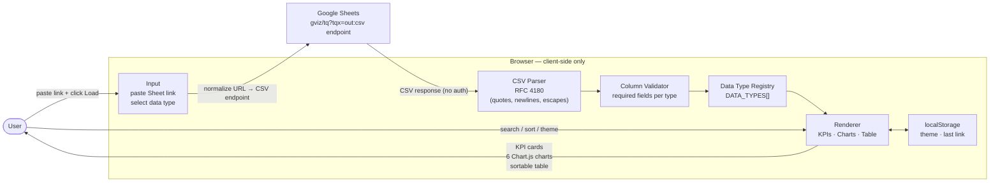
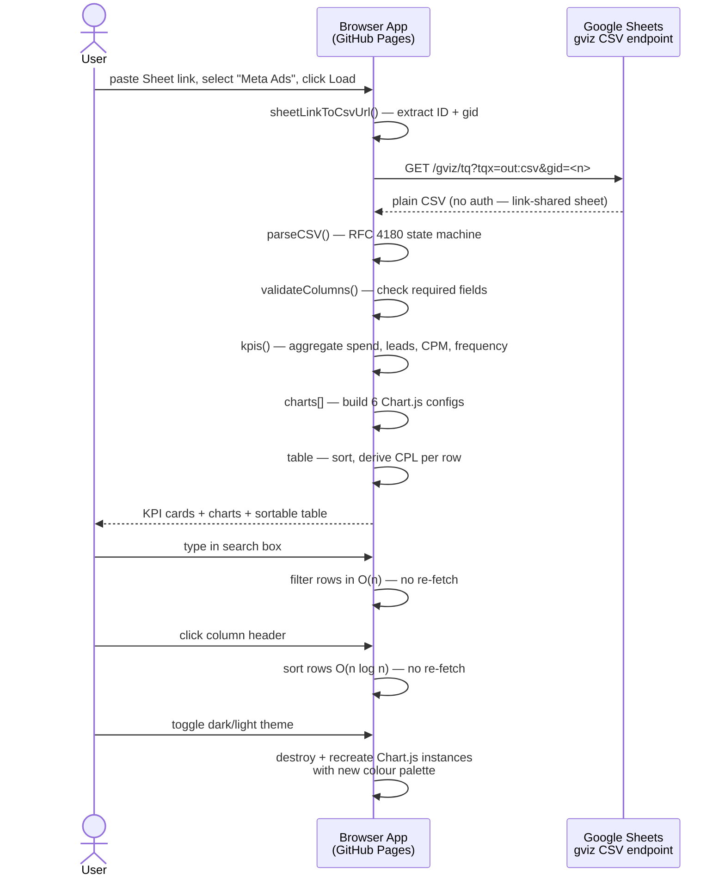

# Sheet Dashboard — Google Sheets → Live Dashboard

A static, **zero-backend web app** that turns any public Google Sheet into a live, interactive dashboard in seconds. Paste a shareable link, pick a data type, and the browser fetches the data directly from Google, parses it client-side, and renders KPI cards, six interactive Chart.js charts, and a searchable, sortable data table — no server, no sign-in, no infrastructure.

!!! abstract "At a glance"
    **Role**: Full-stack engineer (solo) &nbsp;·&nbsp; **Stack**: Vanilla JS · Chart.js · Tailwind CSS · GitHub Pages &nbsp;·&nbsp; **Hosting cost**: $0

    **Live**: [johndoe.github.io/csv-dashboard](https://johndoe.github.io/csv-dashboard/) &nbsp;·&nbsp; **Repo**: [github.com/johndoe/csv-dashboard](https://github.com/johndoe/csv-dashboard)

## Architecture

The entire application is a single HTML page with a vanilla JavaScript module. There is no build step, no bundler, and no backend — all data stays in the browser.

## Highlights
- Built a **hand-rolled RFC 4180 CSV parser** — handles quoted fields, escaped quotes (`""`), and embedded newlines without regex, as a clean state machine. Zero external dependencies for parsing.
- Designed an **extensible data-type registry** (`DATA_TYPES[]`): each type declares its required columns, KPI functions, chart configs, and table definition. Adding a new data source (e.g. Google Analytics, Shopify) requires only appending one object — the generic fetch/parse/render pipeline handles the rest.
- Implemented a **smart link normalizer** (`sheetLinkToCsvUrl`) that accepts full edit URLs, published CSV links, and bare sheet IDs — extracting the `gid` for multi-sheet support — and converts them to the Google `gviz/tq?tqx=out:csv` endpoint with no server involvement.
- Shipped **six theme-aware Chart.js charts** (bar, scatter, doughnut) that recolour in real time on dark/light toggle — Chart.js instances are destroyed and recreated cleanly to avoid memory leaks.
- All computed metrics (cost-per-lead, CPM, frequency) are **derived at render time** from the raw rows — no preprocessing, no stored state. A table column click re-sorts in O(n log n); search filters in O(n) as the user types.
- **Markdown-driven template docs**: each data type's required-columns reference is a `templates/{id}.md` file, fetched and rendered at runtime with Marked.js — editable without touching code, with graceful fallback if missing.
- Deployed with **zero infrastructure**: push to `main`, GitHub Actions uploads the repo as a static artifact and GitHub Pages serves it.

## How It Works

## v1 — Meta Ads Analytics

The first data type targets **Meta (Facebook/Instagram) Ads** exports. Drop in a Sheet with the standard Meta Ads columns and get:

| KPI | Description |
|---|---|
| Total spend | Sum of `Amount spent (USD)` across all rows |
| Total leads | Sum of `Results` |
| Cost-per-lead | Spend ÷ Leads |
| CPM | (Spend ÷ Impressions) × 1,000 |
| Frequency | Impressions ÷ Reach |
| Active ads | Count of rows with status `ACTIVE` |

**Charts:** Spend by ad set · Leads by ad set · Cost-per-lead (top 15 ads) · Spend vs. CPL scatter · Delivery status doughnut · Impressions by ad set

## Tech Stack
`Vanilla JavaScript (ES modules)` · `Chart.js 4` · `Tailwind CSS (CDN)` · `Marked.js` · `GitHub Actions` · `GitHub Pages`

!!! note "Extending the dashboard"
    New data types (e.g. Google Analytics, Shopify, HubSpot) are added by appending one object to `DATA_TYPES[]` with `id`, `label`, `required`, `kpis()`, `charts[]`, and `table` fields. The fetch/parse/validate/render pipeline is fully generic.
