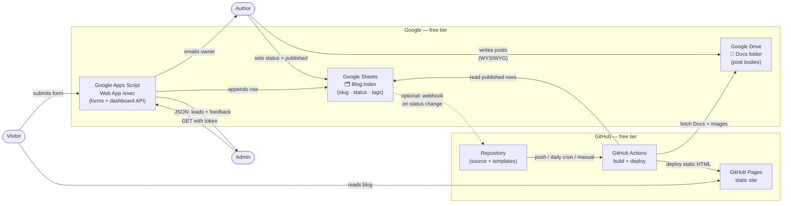
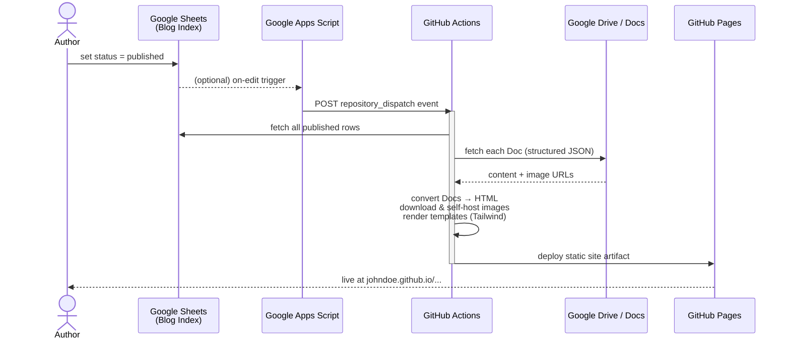
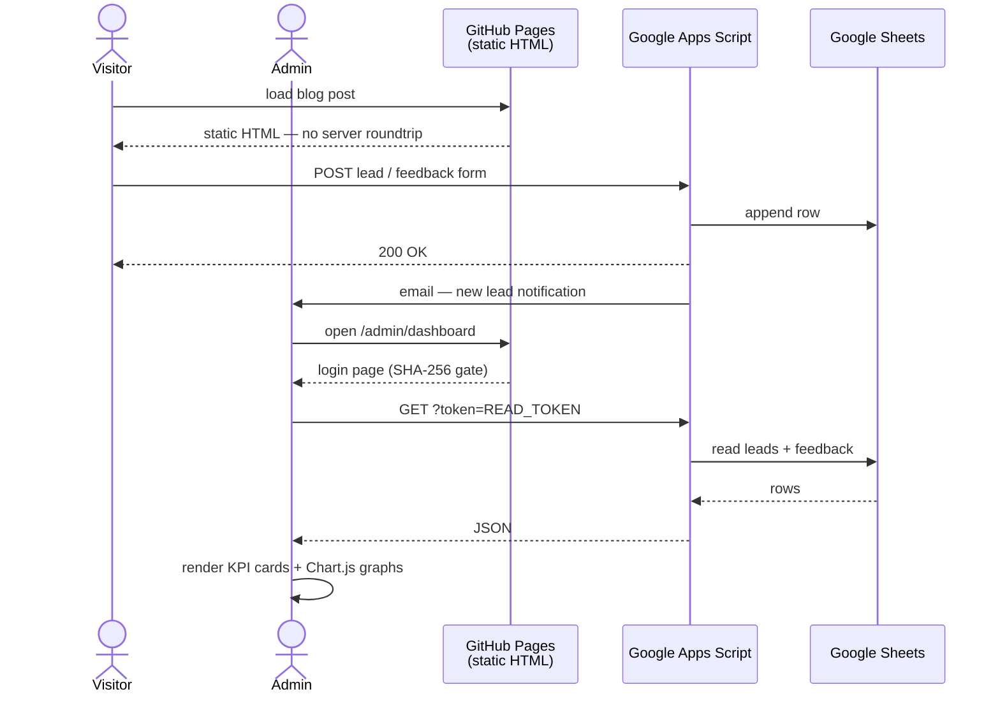

# Gitpress — Zero-Server Blog on Google + GitHub

A static blog CMS with **no servers, no databases, and no monthly bills** — built entirely on two platforms most people already know and trust: **Google** (Docs, Sheets, Apps Script) and **GitHub** (Pages, Actions). Write posts in Google Docs like you would any document; the rest is automatic.

!!! abstract "At a glance"
    **Role**: Full-stack engineer (solo) &nbsp;·&nbsp; **Stack**: Node.js build pipeline · Google APIs (Drive, Docs, Sheets, Apps Script) · GitHub Actions · GitHub Pages · Tailwind CSS &nbsp;·&nbsp; **Hosting cost**: $0

    **Repo**: [github.com/johndoe/gitpress](https://github.com/johndoe/gitpress) &nbsp;·&nbsp; **Example**: [johndoe.github.io/github-blogs](https://johndoe.github.io/github-blogs/) &nbsp;·&nbsp; **Template**: deploy your own blog in minutes — no server required

## Architecture

The system has **no backend process** — only static files on GitHub Pages and Google's always-free, serverless infrastructure. The author's laptop never even needs to run a build; GitHub Actions handles everything.

## Highlights
- Built a **constraint-driven, zero-server CMS** — no databases, no backend processes, no hosting costs. The entire system is stitched from two free platforms (Google, GitHub) with a Node.js build script as the only glue.
- Used **Google Docs as the content source** — authors write in a familiar WYSIWYG editor with real-time collaboration, footnotes, images, and offline support; no Markdown, no proprietary CMS.
- Designed a **Google Sheets + Apps Script backend** for dynamic functionality (lead capture, feedback forms, admin dashboard) on a static site — forms POST directly to Apps Script, which writes to Sheets and emails the owner on new leads, all without a server.
- Built **incremental builds** with a file-based cache: each Doc's `modifiedTime` is stored, so unchanged posts and already-downloaded images are skipped — keeping CI fast regardless of blog size.
- Implemented a **Google Docs → sanitized HTML converter** that handles formatted text, headings, tables, nested lists, embedded images (downloaded and self-hosted), and Drive-hosted video embeds via a custom `[[media: filename]]` syntax.
- Wired **four GitHub Actions triggers** — push, daily cron, manual dispatch, and a repository-dispatch webhook (callable from Apps Script when a post's status changes) — giving the author a choice between instant and scheduled publishing.
- Built a **password-gated admin dashboard** (Chart.js KPI cards, lead tables, feedback summaries) that reads live data from Apps Script with a read token and falls back to static JSON snapshots if the endpoint is unreachable.

## How It Works

### Publishing a post

### Visitor form + admin dashboard

## Build Pipeline
The Node.js build runs entirely inside GitHub Actions via a **Google service-account key** stored as a GitHub Secret — no credentials ever touch the repository. Steps:

1. Authenticate with a service-account key (`GOOGLE_SA_KEY`) and initialize Drive, Docs, and Sheets API clients.
2. Read the Blog Index Sheet; filter rows where `status = published` and `publish_date ≤ today`.
3. For each post, check the cache (`modifiedTime` manifest) — skip if unchanged.
4. Fetch the Doc's structured JSON; extract text blocks, images, and formatting.
5. Download and self-host all images; resolve `[[media: filename]]` Drive-video embeds.
6. Sanitize the HTML (allowlist: headings, links, tables, code, iframes from Drive).
7. Render home, blog-index, and post-detail pages from HTML templates with Tailwind.
8. Upload the site artifact; GitHub Pages deploys it.

## Tech Stack
`Node.js 20` · `Google Drive API v3` · `Google Docs API v1` · `Google Sheets API v4` · `Google Apps Script` · `GitHub Actions` · `GitHub Pages` · `Tailwind CSS (CDN)` · `Chart.js` · `sanitize-html` · `marked`

!!! note "Design trade-offs"
    The admin login is a client-side SHA-256 gate — transparent about its limits and suitable for personal use. The README explicitly documents when to upgrade (Cloudflare Access, Supabase) for stricter access control. The `READ_TOKEN` is intentionally scoped to read-only dashboard data.
