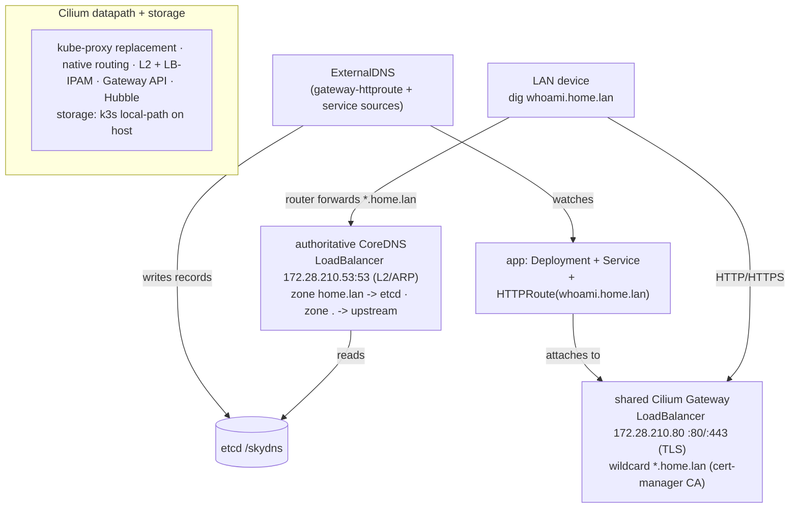

# Homelab — Declarative k8s with Zero-Touch LAN DNS

A clean, declarative **k3d home lab** where shipping a service is the whole contract: deploy a `Deployment` + `Service`, attach an `HTTPRoute` with a `*.home.lan` hostname, and it becomes reachable **by name with automatic HTTPS** from any device on the Wi-Fi — **no manual DNS edits, no certificate wrangling**. DNS records are published automatically by **ExternalDNS** into an authoritative **CoreDNS** that the LAN queries directly.

!!! abstract "At a glance"
    **Role**: Cloud-native / platform engineer &nbsp;·&nbsp; **Scope**: one-click installer, two-plane DNS with automatic record publishing, a shared Cilium Gateway with wildcard TLS, a selectable add-on component stack (monitoring / messaging / workflow / DB), and an optional in-cluster image registry.

    **Live docs**: [johndoe.github.io/home-lab](https://johndoe.github.io/home-lab/) &nbsp;·&nbsp; **Repo**: [github.com/johndoe/home-lab](https://github.com/johndoe/home-lab)

## Architecture

## Highlights
- Designed a **zero-touch service contract**: a workload plus an `HTTPRoute` with a `*.home.lan` hostname is *all* a developer writes — DNS publication and wildcard HTTPS are fully automatic, with nothing to edit on the router or on client devices.
- Built **automatic LAN DNS** with **ExternalDNS** watching Gateway `HTTPRoute` and `Service` sources and writing records into **etcd (`/skydns`)**, which an **authoritative CoreDNS** serves for the `home.lan` zone over a pinned L2 `LoadBalancer` IP that the LAN router conditionally forwards to.
- Ran a deliberate **two-CoreDNS-plane** design — the cluster `kube-dns` (`cluster.local`) and a separate authoritative CoreDNS for `home.lan` exposed to the LAN, with the cluster plane forwarding `home.lan` to the authoritative LB IP so pods resolve it too.
- Delivered a **shared Cilium Gateway** (Gateway API) as the single HTTP/HTTPS entrypoint on a pinned L2 `LoadBalancer` IP, terminating a **`*.home.lan` wildcard certificate** issued by a **cert-manager internal CA** (public ACME can't issue for a local-only TLD).
- Kept the **kube-proxy-free eBPF datapath** — Cilium as the sole CNI with kube-proxy replacement, native routing, **L2 announcements + LB-IPAM** handing real host-reachable IPs from a configured CIDR, plus Hubble for flow observability.
- Shipped a **selectable add-on component registry** — node-exporter, VictoriaMetrics operator, OpenTelemetry operator, Grafana, NATS, Hatchet, CloudNativePG, and FerretDB — each toggleable per install from a declarative registry.
- Added an **optional in-cluster image registry** (`--with-registry`) so a developer can `docker push registry.home.lan/` from any LAN device and the k3s nodes pull it back **by the same name** — HTTPS via the internal CA on a dedicated pinned LB IP, with node-side pulls wired through a containerd `registries.yaml` mirror; replaces the host-only `k3d image import` workflow.
- Wrapped it all in a **one-click `install.sh`** (`--with-router` for Tailscale, `--verbose` to debug) with a clean `uninstall.sh`, version-pinned components, and a runbook/experiment-driven docs site.

## Architecture & Patterns
- **Declarative service contract** — apps attach to the shared Gateway via `parentRefs`; ExternalDNS turns the `HTTPRoute` hostname into a live DNS record. No imperative DNS or TLS steps.
- **Authoritative DNS over etcd/skydns** — ExternalDNS is the writer, CoreDNS the reader; records live in etcd so DNS state is decoupled from any single CoreDNS pod and survives pod churn.
- **Two DNS planes, isolated by purpose** — cluster DNS stays internal while the LAN-facing authoritative plane is the only one exposed via L2, keeping `cluster.local` and `home.lan` concerns cleanly separated.
- **Pinned LB IPs** (DNS `.53`, Gateway `.80`) give the router stable forward targets and devices a stable resolver, independent of pod scheduling.
- **Internal CA for TLS** — cert-manager issues and rotates the `*.home.lan` wildcard; trust the CA once per device and every future `*.home.lan` service is HTTPS with no per-service certificate work.
- **Pinned, reproducible builds** — k3s, Cilium, Gateway API, cert-manager, CoreDNS, ExternalDNS and every add-on are version-pinned via `.env` / the component registry.

## DNS — Automatic, Authoritative, LAN-Facing
The headline capability is name resolution that *just happens*:

- **ExternalDNS** runs with `gateway-httproute` and `service` sources, so attaching a `*.home.lan` `HTTPRoute` (or exposing a `Service`) automatically writes the matching record.
- Records land in **etcd (`/skydns`)** and are served by an **authoritative CoreDNS** for the `home.lan` zone, with `.` forwarded to upstream resolvers.
- The LAN reaches it one of two ways — **router conditional-forward** of `home.lan` → `172.28.210.53` (recommended), or **per-device** resolver — after which `dig whoami.home.lan` resolves to the Gateway and `curl` just works.

## Networking & TLS — Cilium L2 + Wildcard Cert
- **kube-proxy replacement on bare Docker** — Cilium owns service routing; `LoadBalancer` services get real host-reachable IPs via `CiliumLoadBalancerIPPool` + L2 announcements (ARP), no cloud LB.
- **Gateway API** — a single shared Cilium Gateway fronts every app; `*.home.lan` HTTPS is terminated centrally with the cert-manager wildcard.
- **Hubble** — Relay + UI for live flow observability across the datapath.

## Image Registry — Push from the LAN, Pull by Name
An optional `--with-registry` mode stands up an in-cluster Docker registry that closes the loop on the zero-touch model — *shipping* an image becomes as frictionless as *exposing* a service:

- **Push from anywhere on the LAN** — the registry is exposed at `registry.home.lan` on a **dedicated pinned LB IP** (not behind the shared Gateway, to avoid proxy upload-size/timeout limits on large layers), with the DNS record auto-published by ExternalDNS and **HTTPS terminated by a cert-manager cert** whose SANs cover both the hostname and the IP. Trust the internal CA once and `docker push registry.home.lan/` works from any device.
- **Pull by the same name, cluster-wide** — k3s nodes don't resolve the LAN zone, so a containerd `registries.yaml` mirror (written at cluster-create) rewrites `registry.home.lan` → the registry's LB IP. Deployments just reference `image: registry.home.lan/` and the nodes pull it transparently — no per-node DNS, no `k3d image import`.
- **Deliberately simple, with a documented upgrade path** — no auth by default on the trusted LAN; runbooks cover adding `htpasswd` + an `imagePullSecret`, and pulling from a private external registry (Docker Hub) via `imagePullSecret` or cluster-wide `registries.yaml` credentials.
- **Verified end to end** — a test pushes an image and deploys it; the kubelet `Successfully pulled registry.home.lan/...` event confirms the node fetched it from the in-cluster registry.

## Scope & Limitations
This is a **single-host, single-node-focused** lab tuned for developer ergonomics (zero-touch DNS + TLS), and it makes an explicit trade-off versus the earlier [HA K3s Cluster Platform](k3d.md):

- **Not reboot-resilient with multiple agent nodes.** It ships `SERVER_COUNT=1` / `AGENT_COUNT=1` and intentionally omits the lifecycle orchestration of the HA platform (sequential-boot enforcement, immutable Compose orchestrator, automatic CNI reconciliation). With more than one node, a host reboot lets Docker IPAM reassign container IPs, leaving Cilium with **stale `CiliumNode` IPs / LB-IPAM split-brain** that currently needs a **manual** purge (`kubectl delete ciliumnodes --all` + `rollout restart ds/cilium`).
- The deliberate choice was a **cleaner declarative successor** focused on automatic LAN DNS, wildcard TLS, and a curated component stack — leaving multi-node reboot HA to the [k3d + Cilium HA platform](k3d.md), whose sequential-boot orchestrator and self-healing CNI solve exactly that problem.

## Tech Stack
`K3s` · `k3d` · `Cilium (eBPF)` · `kube-proxy replacement` · `Gateway API` · `L2 / LB-IPAM` · `Hubble` · `CoreDNS (authoritative + cluster)` · `ExternalDNS` · `etcd / skydns` · `cert-manager (internal CA)` · `Helm` · `kustomize` · `Docker` · `registry:2 + containerd registries.yaml` · `Bash` · `kubectl` · `envsubst` · `Tailscale / Headscale` · `VictoriaMetrics · OpenTelemetry · Grafana · NATS · Hatchet · CloudNativePG · FerretDB`
