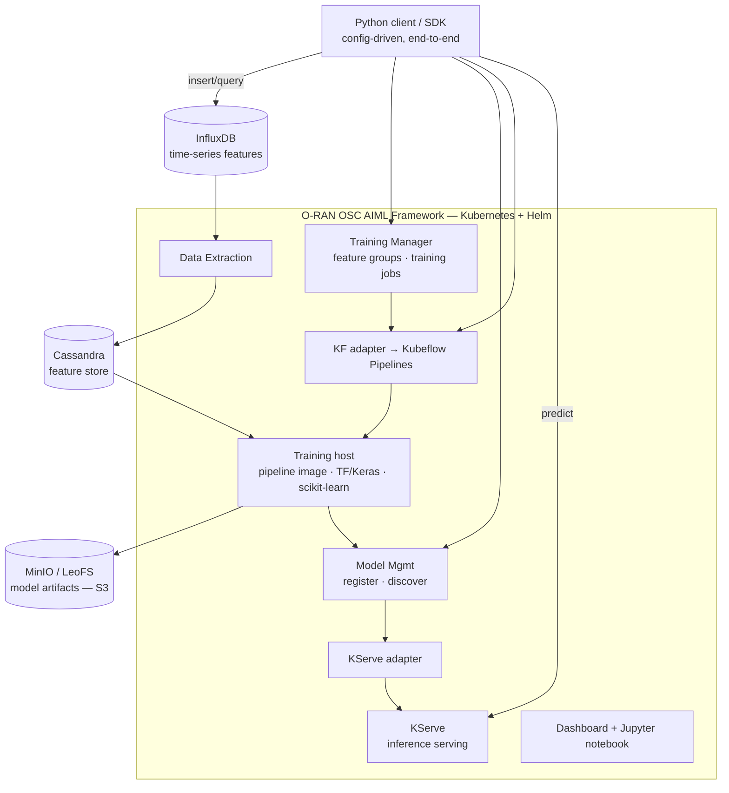

# O-RAN AIML Framework — AI/ML Platform Engineering

A comprehensive AI/ML framework for O-RAN compatible 5G networks, enabling end-to-end machine-learning workflows for network optimization and analytics — from feature ingestion through training to live model serving — driven by a custom Python client.

!!! abstract "At a glance"
    **Context**: 15-credit research project, Integrated Communication Systems group, TU Ilmenau &nbsp;·&nbsp; **Grade**: 1.0 / A (German system) &nbsp;·&nbsp; **Repo**: [github.com/johndoe-corp/O-RAN-AIML-deployment](https://github.com/johndoe-corp/O-RAN-AIML-deployment)

## Architecture

## Demos

<figure markdown>
  <video controls preload="none" width="100%" style="max-width:900px;border-radius:6px">
    <source src="../video/oran-aiml/aiml-end-to-end.mp4" type="video/mp4">
    Your browser does not support the video tag — <a href="../video/oran-aiml/aiml-end-to-end.mp4">download the clip</a>.
  </video>
  <figcaption>End-to-end walkthrough driven by the Python client: create feature group → register model → upload pipeline → run training job → predict.</figcaption>
</figure>

<figure markdown>
  <video controls preload="none" width="100%" style="max-width:900px;border-radius:6px">
    <source src="../video/oran-aiml/model-deployment.mp4" type="video/mp4">
    Your browser does not support the video tag — <a href="../video/oran-aiml/model-deployment.mp4">download the clip</a>.
  </video>
  <figcaption>Model deployment &amp; serving: deploying a registered model via KServe and calling the live inference endpoint.</figcaption>
</figure>

## Python Client / SDK
Built a **config-driven Python client** that automates the full ML lifecycle against the framework's REST APIs — the piece that makes the platform usable end to end.

- **Modular `src/` package** — dedicated modules for `feature_groups`, `model_management`, `pipelines`, `training_job_management`, and `influx_db`, plus shared `helpers`/`constants`, all parameterized from a single `config.json` (framework IPs/ports, InfluxDB, Cassandra, MinIO, LeoFS).
- **Stepwise workflow scripts** (`01`–`07`) — insert data → query data → create feature group → register model → register pipeline → create training job → **predict**, with a `main.py` that orchestrates the whole sequence in one run.
- **InfluxDB ingestion & query** — pandas-based loaders that flatten nested JSON to tabular time-series and write/read measurements via the InfluxDB client.
- **Inference client** — posts feature payloads to the deployed model's serving endpoint and parses predictions.

## ML Workflow & Pipelines
- **Feature group management** — create/register feature groups against **InfluxDB** sources (with an optional **DME** data-exposure path), backed by the **Cassandra** feature store via the Training Manager.
- **Model lifecycle** — end-to-end model registration, discovery, and metadata management through the Model Management service.
- **Kubeflow Pipelines authored in Python** — training and **retraining** pipelines written with the **kfp** SDK (TensorFlow/Keras LSTM and scikit-learn components), compiled to YAML, built into a training-host pipeline image, and uploaded to the framework.
- **Training jobs** — created and monitored through the Training Manager, wiring a feature group + model + pipeline into a tracked job with status reporting.
- **QoE use case** — a Quality-of-Experience pipeline predicting per-cell UE throughput from radio KPIs as the worked example.

## Deployment & Serving
- **Helm-based install** of the full framework on Kubernetes — Training Manager, Model Management, KF adapter, **data-extraction**, **KServe adapter**, dashboard, Jupyter notebook, and **LeoFS** object storage.
- **Model serving via KServe** — registered models are deployed for inference through the KServe adapter; the client calls the live endpoint for predictions.
- **Artifact storage** — trained model artifacts persisted to **MinIO / LeoFS** (S3-compatible) in the pipeline bucket.
- **Automated host setup** — scripted training-host installation, pipeline-image builds (BuildKit), and helm-chart templating.

## Impact
- Enabled organizations to leverage AI/ML capabilities within O-RAN compliant 5G networks.
- Provided a scalable, reproducible framework for network optimization and analytics.
- Established standardized, client-driven workflows for ML model development, deployment, and serving in telecom environments.

## Tech Stack
`Python` · `Kubernetes` · `Helm` · `Kubeflow Pipelines (kfp)` · `KServe` · `TensorFlow / Keras` · `scikit-learn` · `pandas` · `InfluxDB` · `Cassandra` · `MinIO` · `LeoFS (S3)` · `Docker / BuildKit` · `REST APIs`
