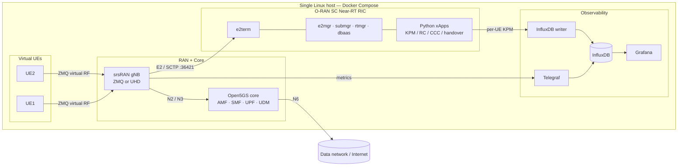

# 5G srsRAN + O-RAN RIC Testbed (Docker)

A reproducible, single-host 5G standalone lab packaged as Docker containers: a real srsRAN gNB, an Open5GS core, and an **O-RAN SC Near-RT RIC** with Python **xApps** that monitor and control the RAN in real time over the **E2 interface**. It runs in two RF modes — **ZMQ virtual RF** (no hardware) for development, and **UHD over-the-air RF** on a **USRP B210 SDR** for real radio-layer work.

!!! abstract "At a glance"
    **Domain**: O-RAN / 5G RAN intelligence &nbsp;·&nbsp; **Repo**: [github.com/radheemCorp/srsran-docker](https://github.com/radheemCorp/srsran-docker) &nbsp;·&nbsp; **Companion**: the [Kubernetes testbed](5g-testbed.md) &nbsp;·&nbsp; **Reference**: [ocudu/ocudu](https://gitlab.com/ocudu/ocudu)

## What it is
A Dockerized end-to-end 5G SA testbed that brings up, on one Linux host:

- A **srsRAN Project gNB** in either **ZMQ** mode (virtual RF — Docker only, ideal for development/CI) or **UHD** mode (real over-the-air RF on a **USRP B210** SDR).
- The **Open5GS** 5G core (AMF, SMF, UPF, UDM) as a Compose service.
- The **O-RAN SC Near-RT RIC** — a lightweight, Kubernetes-free build of the O-RAN RIC platform — wired to the gNB over E2.
- Docker-based **virtual UEs** (ZMQ mode) with iperf throughput testing across the gNB/UPF path, and real UE attach over the air (UHD mode).

## RF / SDR Setup (UHD mode)
- Drives a **USRP B210** software-defined radio over USB; the gNB container runs **privileged** with `/dev/bus/usb` mounted so it can claim the device (`uhd_find_devices` → `type=b200`).
- gNB image **built with `ENABLE_UHD` + `ENABLE_ZEROMQ`** (libuhd 4.7), so one image serves both RF backends.
- Configured the SDR radio unit (`ru_sdr`: `device_driver: uhd`, sample rate, `tx_gain` / `rx_gain`) and matched band / ARFCN / bandwidth / SCS to the gNB cell so a real UE can synchronize.
- Verified the full bring-up: **B210 detected, FPGA loaded, clock-rate negotiated**, then NGAP/AMF `NGSetup` completed against Open5GS and a UE attached over the air.

## Architecture

## O-RAN RIC Integration
The differentiator over a plain gNB lab: a real **RIC platform** with an **E2 control loop**.

- **RIC platform services** run as containers — `e2term`, `e2mgr`, `submgr`, `rtmgr`, `dbaas` (Redis), `appmgr` — from the O-RAN SC images, on a dedicated `ric` network.
- The gNB connects over the **E2 (SCTP)** interface; xApps subscribe to indications and issue control through the RIC.
- **Service models** exercised:
    - **E2SM-KPM** — key performance metrics (throughput, MCS, BLER, PRB usage).
    - **E2SM-RC** — resource control (PRB ratio, slice quotas).
    - **E2SM-CCC** — cell configuration control.

## xApps (Python)
A set of xApps over the RIC E2 interface, including:

- `kpm_mon_xapp` — KPM metric subscription and per-UE monitoring.
- `simple_mon_xapp` — basic indication monitor.
- `simple_rc_xapp` / `simple_rc_ho_xapp` — resource control and **handover** control.
- `simple_ccc_xapp` — cell configuration control.

## Observability
- **Telegraf → InfluxDB → Grafana** pipeline visualizing live radio metrics (MCS, BLER, UE throughput).
- A custom **InfluxDB writer** persists per-UE KPM metrics streamed from the monitoring xApp into time-series storage for Grafana dashboards.

## Engineering
- **Single-host reproducibility** — a shared Dockerfile builds both the gNB and Open5GS; helper scripts (`net_manage.sh`, `dockstatus.sh`, `docker_cleanup.sh`) manage the full Docker + host network lifecycle (n2 / n3 / n6 / ric).
- **Two RF backends** behind the same topology — virtual ZMQ for development and UHD for real-SDR radio-layer work.
- **Documented operations** — setup, throughput testing, host performance tuning, and a running log of debugging journals and known issues.

## Key Achievements
- Stood up a **complete single-host 5G SA testbed** — srsRAN gNB + Open5GS core + O-RAN Near-RT RIC — reproducibly via Docker Compose, **without Kubernetes**.
- Established a working **O-RAN E2 control loop**: Python xApps subscribing to live KPM indications and issuing RC / CCC control to the gNB.
- Demonstrated **real over-the-air 5G** with a **USRP B210** SDR — sustained ~4 Mb/s downlink video streaming to a UE (peak 5.74 Mb/s).
- Validated **end-to-end user-plane traffic** between UEs in ZMQ mode — iperf throughput and sustained VoIP-style flows.
- Built a **single gNB image serving both RF backends** (ZMQ virtual RF and UHD real SDR), switchable without a rebuild.
- Streamed **per-UE KPM metrics** into a Telegraf → InfluxDB → Grafana pipeline for live RAN observability.

## Experiments & Results
Workloads run end-to-end across both RF modes and observed live in the Grafana dashboards.

<figure markdown>
  { loading=lazy }
  <figcaption>UHD over-the-air mode: live video streaming to a UE via a USRP B210 SDR, ~4 Mb/s downlink (peak 5.74 Mb/s) on the srsRAN Grafana dashboard.</figcaption>
</figure>

<figure markdown>
  { loading=lazy }
  <figcaption>ZMQ mode: iperf throughput between two attached UEs — downlink/uplink bitrate, BLER, and MCS index per UE.</figcaption>
</figure>

<figure markdown>
  { loading=lazy }
  <figcaption>ZMQ mode: sustained low-bitrate VoIP-style traffic between two UEs (~174 kb/s), exercising steady-state RAN behavior.</figcaption>
</figure>

## Tech Stack
`srsRAN Project` · `Open5GS` · `O-RAN SC Near-RT RIC` · `E2 / E2AP` · `E2SM-KPM` · `E2SM-RC` · `E2SM-CCC` · `Python (xApps)` · `Docker` · `Docker Compose` · `ZMQ` · `UHD / USRP B210` · `Telegraf` · `InfluxDB` · `Grafana` · `iperf`
