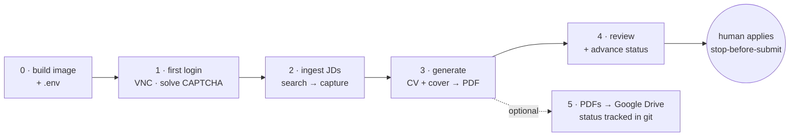
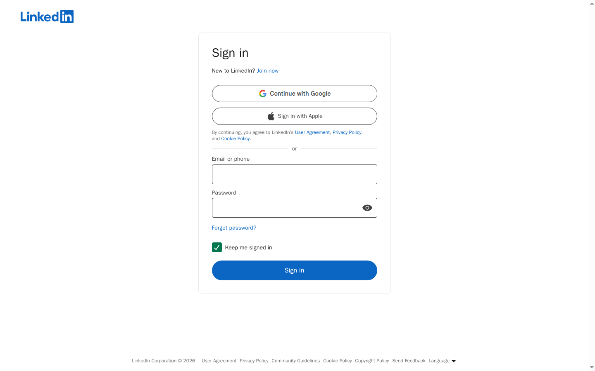
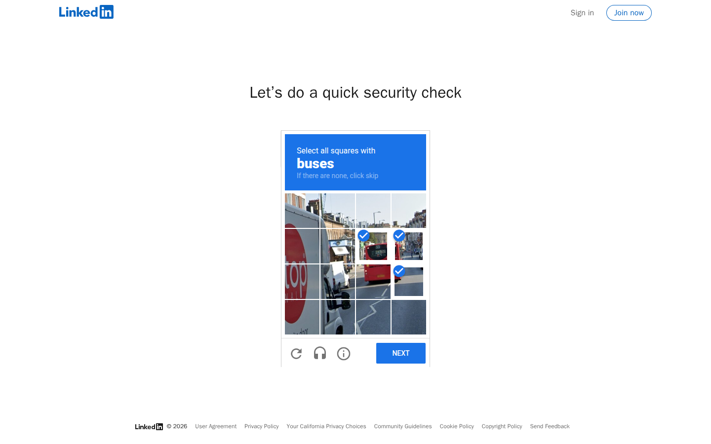

# Runbooks — LinkedIn → tailored application

Operational, copy-paste runbooks for the **end-to-end pipeline**: drive a logged-in LinkedIn
session from a container, capture job descriptions, generate a tailored CV + cover letter, and
prepare each application for submission.

!!! warning "Stop-before-submit"
    **Code never submits an application.** Every runbook stops at a ready-to-apply package that
    a human reviews and submits by hand. There is no auto-apply path anywhere in this repo.

> **Private, real-data repo.** This drives the real account and produces usable applications.
> Captured JDs live in gitignored `vault/`; generated applications live in `applications/`
> (Markdown + LaTeX, outside the published `docs/` tree). Tailored PDFs go to Google Drive. The
> public site shows only the portfolio — no application ever reaches it.

## The end-to-end flow



Each container invocation is a one-shot `docker compose run` task (the `make docker-*` targets
wrap it) — it does its job and exits. The flow is deliberately step-by-step so a human can solve
the CAPTCHA, review the captured roles, and review the generated documents before anything is
sent.

---

## Detailed Runbook Guides

Refer to these dedicated operational runbooks for specific workflows:

*   📂 [PostgreSQL MCP Server](runbooks/mcp-server.md) — Connect external AI agents safely to your database and pipelines.
*   📂 [Search & Summarize Emails](runbooks/search-emails.md) — Gmail Apps Script Proxy search, read, and local Ollama summarization.
*   📂 [Search Jobs on Fraunhofer](runbooks/search-fraunhofer.md) — Headless, public-portal job harvesting.
*   📂 [Search Jobs on LinkedIn](runbooks/search-linkedin.md) — Login session warmup, ad-hoc search, and batch ingest workflows.
*   📂 [Create Tailored Application](runbooks/create-application.md) — Generating from text files, LinkedIn URLs, or Fraunhofer postings.

---

## Runbook 0 — Build & configure (one-time)

```bash
cp .env.example .env          # then edit: see below
make docker-build             # build the ingest container image
```

Set in `.env` (never committed — `.env` is gitignored):

| Key | Purpose |
|-----|---------|
| `LINKEDIN_USER` / `LINKEDIN_PASS` | the LinkedIn account the session logs in as |
| `VNC_PASSWORD` | password for the VNC viewer used to solve a CAPTCHA/OTP (max 8 effective chars) |
| `CV_TAILOR_PROVIDER` / `CV_TAILOR_MODEL` | generation backend (Anthropic API, or a local Ollama / OpenAI-compatible endpoint) |
| `CV_TAILOR_OLLAMA_BASE_URL` | endpoint URL when using a local model |

The model/provider knobs live **only** in `.env`. Credentials are read once at login and are
never logged.

---

## Runbook 1 — First login (warm the profile, solve the CAPTCHA)

A first credentialed login from a fresh browser profile reaches LinkedIn's **security check**.
Solve it once over VNC; the persistent profile then counts as a "recognized device" and later
logins are silent.

```bash
# Bind the VNC port to your tailnet IP (or omit VNC_BIND for 127.0.0.1):
VNC_BIND=<tailnet-ip> VNC_PASSWORD=<pw> make docker-login
```

Then attach a VNC viewer to `<tailnet-ip>:5900` (e.g. TigerVNC on Windows). You will see the
LinkedIn sign-in page the container drives:



The session types the credentials at a human pace and submits. When LinkedIn raises a security
check, solve it in the VNC window:



Once solved, the login completes and the warm profile is saved to `vault/profile/`. The
`--keywords warmup --limit 0` login target captures no jobs — it exists only to establish the
session.

!!! tip "Connection refused over VNC?"
    The published `:5900` port only exists **while a container is running**. Start a
    `make docker-login` (or any `docker-ingest`) first, *then* attach the viewer. `make docker-vnc`
    prints the connect details.

---

## Runbook 2 — Ingest job descriptions

With a warm profile, search LinkedIn and capture full job descriptions directly inside PostgreSQL:

```bash
make ingest KEYWORDS="platform engineer" LOCATION="Remote" LIMIT=5
```

- Each role lands directly in the PostgreSQL database `jobs` table (with standard backups written to `vault/jds/<slug>.txt` + `.json`).
- Duplication checks are done automatically against the database to prevent duplicate ingestion.
- `KEYWORDS` is required; `LOCATION` and `LIMIT` (default 5) are optional.

If the session was logged out, it silently re-logs-in from the warm profile. If that login is
itself challenged, repeat **Runbook 1** to re-solve over VNC.

---

## Runbook 3 — Generate a tailored CV + cover letter

Turn one captured JD (referenced by database slug) into a tailored application, on the host, against the model configured in `.env`:

```bash
make new SOURCE=acme-platform-engineer-123 RECIPIENT="Hiring Team"
```

Output lands in `applications/<slug>/` and is automatically saved to the PostgreSQL database `applications` table:

| File | What |
|------|------|
| `cv.md` / `cv.pdf` | tailored CV — top-3 relevant projects, skills ordered per role |
| `cover-letter.md` / `cover-letter.pdf` | tailored cover letter |
| `job-description.md` | the JD it was generated against |
| `manifest.json` | model, seed, prompt + input hashes (re-derivable) |

The ranker is pure and deterministic; the LLM only writes prose around facts pinned in `data/` —
it never fabricates experience. See [Architecture](architecture.md) for the hard Boundary.

---

## Runbook 4 — Review & advance the lifecycle (stop-before-submit)

1. **Review** `applications/<slug>/cv.md` and `cover-letter.md`. Edit the Markdown if needed.
2. **Apply by hand.** Submit the application yourself in the browser. Code does not.
3. **Database push**: To save any local Markdown edits you made back into PostgreSQL:
   ```bash
   make db-push ID=acme-platform-engineer-123
   ```
4. **Record the transition**: Advance status directly in the database:
   ```bash
   make status ID=acme-platform-engineer-123 STATUS=applied
   # draft → applied → interview → offer | rejected | withdrawn
   ```

---

## Runbook 5 — Render PDFs, push to Drive, track status

The tailored CV + cover letter are rendered as **bilingual (EN+DE) PDFs** with the LaTeX template and stored in **Google Drive** — they are never published to the site. Status lives in PostgreSQL.

```bash
make pdf ID=<slug>             # render cv.tex/cover-letter.tex → bilingual PDFs
make upload ID=<slug>          # compile + upload PDFs to Google Drive (see apps-script/README.md)
make sheet-push                # sync all database application statuses with Google Sheets
make sheet-pull                # pull Google Sheets status modifications back to PostgreSQL
```

The public portfolio still ships via `make build` (`mkdocs build`) + CI; no company name ever
reaches `site/` because `applications/` lives outside `docs/`.

---

## Operational runbooks

### Re-login after an auth failure

The warm profile auto-re-logs-in on the next `make docker-ingest`. If LinkedIn challenges that
login, you'll get a fresh `vault/challenges/*.png` capture and the VNC resolver — re-run
**Runbook 1** to solve it.

### Wipe a stale / broken profile

If the saved session is corrupt or you switch accounts, remove the profile (it's owned by the
container uid) and re-run **Runbook 1**:

```bash
docker run --rm -v "$(pwd)/vault:/v" alpine rm -rf /v/profile
```

### Inspect a captured challenge

Every challenge is dumped to `vault/challenges/` as a screenshot + HTML (gitignored) so you can
see exactly what LinkedIn showed when a run paused.

---

→ **Design & threat model:** [Architecture](architecture.md)
→ **Every CLI flag & env var:** [CLI](cli.md)
