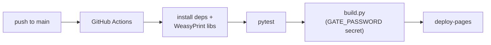

# Setup

How to run cv-tailor end to end: generate a tailored application, build and test the gate
locally, then deploy to GitHub Pages.

!!! warning "Public repo — fictional persona"
    This project is public and ships **no real personal data**. The identity
    ("John Doe", `john.doe@example.com`, `github.com/johndoe`) and employer names are
    invented; the projects are kept for realism. Never commit real names, emails, phone
    numbers, or personal links.

## Prerequisites

- **Python 3.11+**
- **WeasyPrint native libraries** (for PDF rendering) — on Debian/Ubuntu:
  ```bash
  sudo apt-get install -y libpango-1.0-0 libpangocairo-1.0-0 libcairo2 libgdk-pixbuf-2.0-0
  ```
- An **Anthropic API key** — only for the generation step.

## Install

```bash
# Site build + gate only (mkdocs-material, weasyprint, cryptography, pyyaml):
pip install -e .

# Add the generation pipeline (Anthropic backend) and the optional URL fetcher:
pip install -e '.[generate,fetch]'
playwright install chromium        # only needed to fetch job URLs

# Or the local Ollama / OpenAI-compatible backend instead of Anthropic:
pip install -e '.[ollama]'
```

## 1. Generate a tailored application (local)

```bash
export ANTHROPIC_API_KEY=...
cv-tailor new path/to/job.txt          # a pasted .txt/.md file …
cv-tailor new https://example.com/job  # … or a job URL (needs Playwright)
cv-tailor new path/to/job.txt --recipient "Jane Smith"   # personalize the salutation
```

### Generation provider

Generation defaults to **Anthropic** (`ANTHROPIC_API_KEY`). To run against a **local Ollama**
(or any OpenAI-compatible server) instead — offline, no API key:

```bash
cv-tailor new path/to/job.txt --provider ollama \
  --ollama-url http://localhost:11434/v1 --model qwen3.5:35b
```

Equivalently via env: `CV_TAILOR_PROVIDER=ollama`,
`CV_TAILOR_OLLAMA_BASE_URL=http://localhost:11434/v1`, `CV_TAILOR_MODEL=qwen3.5:35b`. Point
`--ollama-url` at your own host. CI never generates, so no provider config is needed there.

One provider per run; pick the model with `--model` (or `CV_TAILOR_MODEL`):

| Provider | Install | Default model | Auth |
|---|---|---|---|
| **Anthropic** (default) | `.[generate]` | `claude-sonnet-4-6` | `ANTHROPIC_API_KEY` |
| **Ollama** / OpenAI-compatible | `.[ollama]` | `qwen3.5:35b` | none (local) |

```bash
cv-tailor new path/to/job.txt --model claude-opus-4-8        # Anthropic, Opus
cv-tailor new path/to/job.txt --provider ollama --model llama3.1:70b
```

The **[CLI reference](cli.md)** lists every flag, env var, and sample command.

The cover letter is rendered as a real letter (letterhead → date → salutation → body →
sign-off, no title). `--recipient` sets `Dear Jane Smith,`; omit it for `Dear Hiring Team,`.
You can also edit `recipient:` in the generated `cover-letter.md` front matter later.

This writes `docs/jobs/<slug>/` with `cv.md`, `cover-letter.md`, `job-description.md`, and
`index.md` (the gated unlock hub). The flow:

```mermaid
flowchart LR
    A["cv-tailor new &lt;job&gt;"] --> B[JobSpec]
    B --> C[rank: top-3 + skills]
    C --> D[LLM writes (Anthropic / Ollama)\ncv.md + cover-letter.md]
    D --> E[docs/jobs/&lt;slug&gt;/]
    E --> F[review · edit · commit]
```

Then:

1. **Review and edit** the generated Markdown — it is the source of truth for the deploy.
2. **Add it to the nav** in `mkdocs.yml` (the CLI prints the exact line), e.g.:
   ```yaml
   - Tailored:
       - Platform Engineer (locked): jobs/sample-platform-engineer/index.md
   ```
3. **Commit** it.

!!! tip "Model"
    The Anthropic backend defaults to Claude Sonnet 4.6. Use Opus for harder reasoning:
    ```bash
    cv-tailor new path/to/job.txt --model claude-opus-4-8
    ```

## 2. Build + test the gate locally

```bash
GATE_PASSWORD=test python build.py
python -m http.server -d site 8000
# open http://localhost:8000/
```

- `GATE_PASSWORD` seals the gated documents (use anything for local testing).
- The gated CV/cover-letter HTML is self-contained (CSS inlined), so it renders the same in
  the unlock iframe and the PDF — no base-URL configuration needed.

What to verify:

- The public portfolio and general CV load freely; the general CV's **Download PDF** works.
- A `jobs/<slug>/` page shows a password prompt. The correct password renders the CV /
  cover letter in an iframe and downloads the decrypted PDF; a **wrong password fails**.
- Nothing gated leaks: `grep -rl "<some gated phrase>" site/ | grep -v '\.enc$'` is empty.

## 3. Run the tests

```bash
pip install pytest
pytest -q        # ranking logic — no browser, no API key
```

## 4. Deploy to GitHub Pages



One-time repo configuration:

1. **Settings → Pages → Source: GitHub Actions.**
2. **Settings → Secrets and variables → Actions →** add a **`GATE_PASSWORD`** secret. This
   is the password visitors will use to unlock the gated documents.

Every push to `main` then renders, gates, and deploys via
[`.github/workflows/deploy.yml`](https://github.com/johndoe/cv-tailor). No API key is used
in CI — generation is always a local step.

## Environment variables

| Variable | Where | Purpose |
|---|---|---|
| `ANTHROPIC_API_KEY` | local generation | authenticates the Anthropic backend |
| `CV_TAILOR_PROVIDER` | local generation | `anthropic` (default) or `ollama` |
| `CV_TAILOR_MODEL` | local generation | model override (default: `claude-sonnet-4-6` / `qwen3.5:35b`) |
| `CV_TAILOR_OLLAMA_BASE_URL` | local generation | OpenAI-compatible base URL (default `http://localhost:11434/v1`) |
| `CV_TAILOR_OLLAMA_API_KEY` | local generation | key for that endpoint (default `ollama`) |
| `GATE_PASSWORD` | build (local + CI secret) | seals/unlocks the gated documents |

See [Architecture](architecture.md) for how the pieces fit together.
