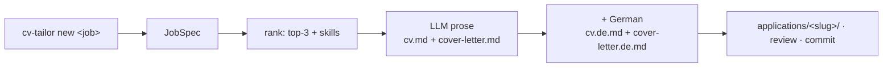
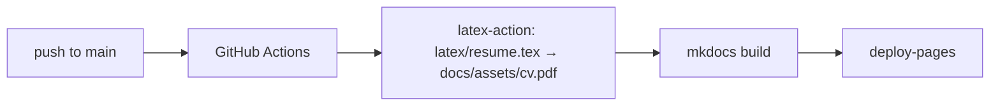

# Setup

How to run my-cv end to end: generate a tailored application, render bilingual PDFs, upload them
to Google Drive, track status in git, and deploy the public portfolio.

!!! note "Private repo — real data"
    This repo holds real personal data (`data/`). The public site (`radheem.github.io/my-cv`)
    publishes **only the portfolio**; `applications/` lives outside `docs/` and never reaches the
    site. Keep the repo private and credentials out of commits.

## Prerequisites

- **Python 3.11+**
- An **LLM** for generation: an **Anthropic API key**, or a local **Ollama** / OpenAI-compatible
  endpoint.
- **LaTeX** for PDF rendering: a local TeX Live (`latexmk`, `texlive-latex-recommended`,
  `texlive-lang-german`, `lmodern`) **or** Docker (the build script falls back to the
  `texlive/texlive` image — no local TeX needed).
- **Google Drive** upload (optional): a deployed Apps Script web app — see
  [apps-script/README.md](https://github.com/radheem/my-cv/blob/main/apps-script/README.md).

## Install & Configure

Because the entire application pipeline is containerized, there is **no need to install Python, Playwright, or dependencies on your host**.

### Step 1: Copy Environment Configuration
```bash
cp .env.example .env                # then edit and fill in keys (VNC, APPS_SCRIPT, Drive)
```

### Step 2: Build the Scraper Container
```bash
make docker-build
```

No database setup or PostgreSQL container is required. `cv-tailor` uses a zero-config file-based architecture where local files (`vault/jds/` and `applications/`) are the source of truth, and DuckDB is utilized as an in-memory query engine.

## 1. Generate a tailored application

```bash
export ANTHROPIC_API_KEY=...
cv-tailor new path/to/job.txt                       # a pasted .txt/.md file …
cv-tailor new https://example.com/job               # … or a job URL (Playwright)
cv-tailor new path/to/job.txt --recipient "Jane Smith"
```

Defaults to Anthropic; for a local model: `--provider ollama --ollama-url http://host:11434/v1
--model qwen3.5:35b` (or the `CV_TAILOR_*` env vars). `new` also writes the German translation by
default (`--no-translate` to skip). See the **[CLI reference](cli.md)** for every flag.



This writes `applications/<slug>/` with `cv.md` (+ `cv.de.md`), `cover-letter.md` (+ `.de`),
`job-description.md`, and `index.md` (metadata + `status: draft`). **Review and edit** the
Markdown — it is the source of truth — and **have the German checked** before sending.

## 2. Render the bilingual PDFs

```bash
make pdf ID=<slug>      # cv.tex/cover-letter.tex → 2-page EN+DE cv.pdf / cover-letter.pdf
```

`engine/latex.py` renders the `.tex` (the LLM never emits LaTeX); `scripts/build-application.sh`
compiles with local `latexmk` or the `texlive/texlive` Docker image. PDFs are gitignored.

## 3. Upload to Google Drive + track status

```bash
make upload ID=<slug>                       # compile + push PDFs to Drive; writes drive_url
cv-tailor status <slug> applied             # advance lifecycle status in applications/<slug>/index.md
cv-tailor sync-sheets                       # pull Google Sheets status modifications and push local statuses back
```

Upload and sheet sync need `APPS_SCRIPT_URL` / `APPS_SCRIPT_TOKEN` in `.env`. Status transitions are stored directly in the local `index.md` files. Backup exports reside on-disk under `/application-data/` if needed.

## 4. Run the tests

```bash
make test        # ranking + render + MD→LaTeX — no browser, no API key, no LaTeX
```

## 5. Deploy the public portfolio



One-time: **Settings → Pages → Source: GitHub Actions**. No secrets are needed — CI only compiles
the generic CV PDF and builds the portfolio (`.github/workflows/deploy.yml`). Generation, PDF
rendering, and Drive upload are always local steps.

## Startup Scraper & Login Control

When deploying the container stack (`docker compose up -d`), you can control the active background crawler and automated LinkedIn credential login behavior using `.env` parameters to prevent bot detection and facilitate manual VNC logins.

### Auto-Crawler Boot (`SCRAPE_JOBS`)
- **Variable:** `SCRAPE_JOBS=false` (Default: `false`)
- **Behavior:**
  - **`true`:** The container automatically triggers `cv-tailor hunt` on boot.
  - **`false`:** The container skips the auto-hunt crawl, prints a clean status message, and enters an idle state (`sleep infinity`), keeping the container alive. You can trigger hunts manually anytime with `docker compose exec -it ingest cv-tailor hunt`.

### Automated Login Override (`LOGIN_ON_START`)
- **Variable:** `LOGIN_ON_START=true` (Default: `true`)
- **Behavior:**
  - **`true`:** Automatically types credentials for cold sessions.
  - **`false`:** If not authenticated, the crawler suspends automated credential typing (avoiding CAPTCHA traps) and halts. It emits warning JSON logs and enters a 5-minute polling loop waiting for you to connect via VNC (port 5900) and log in manually. Once logged in, it resumes crawling automatically. If 5 minutes pass without login, the Python script exits gracefully, and the container idles.

## Environment variables

| Variable | Where | Purpose |
|---|---|---|
| `ANTHROPIC_API_KEY` | local | Anthropic backend auth |
| `CV_TAILOR_PROVIDER` / `CV_TAILOR_MODEL` | local | provider + model |
| `CV_TAILOR_OLLAMA_BASE_URL` / `CV_TAILOR_OLLAMA_API_KEY` | local | local endpoint |
| `APPS_SCRIPT_URL` / `APPS_SCRIPT_TOKEN` / `GDRIVE_FOLDER_ID` | local | Google Drive upload |
| `SCRAPE_JOBS` | container | If true, auto-starts crawler on startup (default: false) |
| `LOGIN_ON_START` | container | If false, pauses and polls for manual VNC login (default: true) |

See [Architecture](architecture.md) for how the pieces fit together.
